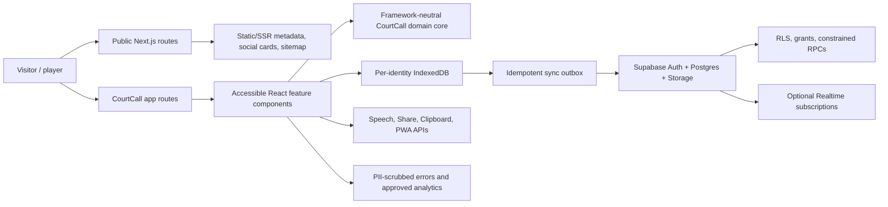

# CourtCall Production UX/UI, Product, Accessibility, Security, and Reconstruction Audit

**Audited product:** [courtcall13.win](https://courtcall13.win/)  
**Audit date:** 26 July 2026  
**Workspace build:** CourtCall `v0.12 Beta`  
**Scope:** public site, 19 application screens, responsive rules, PWA behavior, content, assets, forms, frontend architecture, production HTTP behavior, connected Supabase project, accessibility, SEO, performance, and a world-class reconstruction plan.

## Evidence notation

- **Confirmed** — observed in production HTTP output, the deployed-equivalent workspace, automated tests, W3C validation, or the connected Supabase project.
- **Calculated** — derived from confirmed CSS, dimensions, payloads, or WCAG formulas.
- **Estimated** — a visual/layout value inferred from the implementation where a rendered measurement was unavailable.
- **Recommended** — a proposed target, not current behavior.

The audit is intentionally a specification, not a code patch. No product files, production data, or Supabase configuration were changed during this review.

---

# 1. Executive summary

## 1.1 Product overview

CourtCall is an offline-first pickup-basketball operating system. Its strongest product loop is: create or choose players, form fair teams, configure a game, keep score quickly, attribute player actions, save a result, and reuse the data for history, queues, tournaments, and communities. The target audience is pickup organizers, captains, rec-league players, tournament hosts, and recurring basketball groups that presently coordinate through memory, paper, chat threads, or generic scoreboards.

The brand is energetic, direct, court-side, and utility-led. The dark near-black surfaces, bright basketball orange, condensed Bebas Neue display type, Inter UI type, large scores, glows, motion, and sports emoji make it feel like a live game tool rather than an administrative product. The voice is short and active: “Start Quick Game,” “Who Got Next,” “Ready to run?”, and “Keep the game moving.”

The product already has unusual breadth for a beta: quick scoring, shot and game clocks, voice commands, named players, team balancing, queues, match history, two tournament formats, communities, posts, members, events, gallery, ratings, leaderboards, local analytics, PWA installation, offline caching, cloud sync, export/import, settings, help, legal pages, and sharing. All 56 current unit/static-contract tests pass.

## 1.2 Main journeys

1. **Fast court-side scoring:** open CourtCall → continue locally or sign in → Quick Game → select rules and teams → score via touch or voice → review/share result.
2. **Fair-team organization:** add and rate players → generate balanced/random/captain-draft teams → move teams into the queue → start a game.
3. **Tournament operation:** create round-robin or knockout competition → generate fixtures → play/record games → update standings/bracket → crown winner.
4. **Persistent basketball group:** create/join community → publish updates → manage members/players → schedule events and RSVPs → share photos → view leaderboards.
5. **Returning organizer:** reopen installed PWA → resume active game or inspect recent match, next run, queue, and community activity.
6. **Cloud continuity:** create account → choose whether to sync local data → use the same account across devices → recover access by email.

## 1.3 Overall assessment

CourtCall has a compelling core and a distinctive visual identity, but it is not ready to be called world-class until identity isolation, authentication, first-visit conversion, narrow-mobile layout, light theme, accessibility validity, media persistence, and production hardening are fixed. The largest gap is not visual polish; it is trust. A sports organizer will forgive a slightly plain card. They will not forgive another account seeing their saved data, a PIN row becoming unusable on a small phone, photos disappearing with browser storage, or a sign-in method that exposes only one million possible passwords.

| Dimension | Current state | World-class target |
|---|---|---|
| Core game utility | Strong beta; broad and thoughtfully local-first | Preserve speed, make score entry nearly error-proof, validate on real courts |
| First-visit conversion | Poor: `/` sends a new user to auth/profile while the marketing page is effectively orphaned | Public value proposition first; Quick Game remains one tap away |
| Information architecture | Feature-rich but 19 hash-routed screens in one document | Real public URLs; coherent app routes; clear logged-out/guest/account states |
| Visual design | Distinctive dark sports system, good hierarchy in game views | Resolve theme/contrast inconsistency; professional original asset system |
| Mobile | Mobile-first intent, but critical 320–390px clipping risks | Verified 320px reflow and one-handed court use across supported devices |
| Accessibility | Several good foundations; invalid HTML and AA failures remain | WCAG 2.2 AA with automated and manual assistive-tech coverage |
| Performance | Fast-enough transfer in this test region; heavy parsing and one giant DOM | Route-level rendering, code splitting, hard budgets, verified CWV |
| SEO | Basic metadata/OG present; hash routes and soft 404s undermine indexing | Indexable public route set, correct sitemap/404s, page-specific metadata/schema |
| Security/privacy | RLS enabled and migrations hardened; client identity cache leak and weak online credential | Per-account local namespaces, passwordless/passkey auth, defense-in-depth headers |
| Backend | Healthy Supabase project; 11 RLS tables; no production rows at audit time | Typed schema, Storage, observability, tested sync/conflict model, staged migrations |
| Quality system | 56 tests pass, but deployment is not test-gated and has no browser suite | CI gates for unit, integration, E2E, axe, HTML, links, headers, screenshots, budgets |

## 1.4 Release-blocking and high-priority findings

| ID | Priority | Status | Finding | User/business impact | Required response |
|---|---:|---|---|---|---|
| CC-01 | **P0** | Confirmed in code paths | Account switching clears only the community mirror. Games, matches, tournaments, builder state, and active-game keys remain global; history/dashboard do not consistently filter `ownerId`; cloud merges retain unmatched local records. | On a shared device, account A’s records can appear to account B or a guest. This is a privacy and trust failure. | Namespace all identity-scoped local data by account/guest profile, migrate existing keys, clear memory on every auth transition, filter every read/write, and add cross-account E2E tests. |
| CC-02 | **P0 before public user growth** | Confirmed | The six-digit numeric PIN is sent to Supabase as the actual account password. Maximum space: 1,000,000 values; trivial-value blocking and lockout are client-side. Leaked-password protection is disabled on the current free plan. | Credential stuffing/brute-force risk; misleading “PIN” security model. | Use email OTP/magic link or passkeys for cloud authentication. Keep a PIN only as an optional local device unlock. If retaining passwords, require real passphrases plus server controls, CAPTCHA/rate limits, recovery, and MFA. |
| CC-03 | **P1** | Confirmed | A fresh visit to `/` without a saved profile opens Profile/Auth. The rich marketing landing exists inside the private `hub` screen and has no stable public route. | Search and referral visitors hit a credential choice before understanding the product; marketing work is largely invisible and refresh-unstable. | Make `/` a true public landing page; use `/app` or `/dashboard` for the product and `/login` for auth. Keep “Start Quick Game” as the dominant CTA. |
| CC-04 | **P1** | Calculated from CSS | Six 44px PIN boxes plus five 8px gaps require 304px before parent padding. The inner auth width is roughly 250px at 320px and 290px at 360px, so the row clips. Team color selectors also exceed available width in the two-team grid near 320px. | Sign-in/create/reset and game setup can become unusable on small phones; fails 320px reflow intent. | Use a responsive OTP grid/single segmented field; stack or wrap setup teams below 340px; test 320×568 and 360×640. |
| CC-05 | **P1** | Confirmed from theme rules | Light/System-light swaps text tokens to dark while major landing/header/bottom-nav/game-preview surfaces retain hard-coded dark backgrounds. | Dark-on-dark text and inconsistent mixed-theme screens. | Either make the product intentionally dark-only for launch or complete semantic light-theme tokens and screenshot-test every route. |
| CC-06 | **P1** | Calculated | White on brand orange `#f97316` is 2.80:1; white on the landing CTA gradient is about 2.58–3.16:1; `#64748b` on `#0d1117` is 3.98:1. These combinations are used for small text. | WCAG 2.2 AA contrast failures and reduced readability outdoors. | Use near-black text on bright orange or darken CTA orange to around `#c2410c`; raise muted small text to at least `#94a3b8`; test every state. |
| CC-07 | **P1** | Confirmed | Uploaded community/post images become base64 strings in localStorage and are intentionally excluded from cloud sync. A few 2MB images can exhaust typical browser quota. | Lost/unsynced media, cross-device inconsistency, potential total save failure. | Use Supabase Storage with compression, responsive derivatives, signed/public rules, quotas, and IndexedDB offline upload queue. |
| CC-08 | **P1** | Confirmed by W3C validator | Production returns 59 HTML errors, including 48 invalid `<div>` descendants inside `<button>`, invalid tabpanel usage, invalid autocomplete tokens, generic-div ARIA, invalid dialog semantics, a heading skip, and a CSS parse error. Auth errors lack live announcements. | Browser/assistive-tech inconsistency and expensive future QA. | Replace invalid structures with valid phrasing content or card wrappers; repair roles/autocomplete/heading order; make errors `role="alert"` or `aria-live`; gate CI on zero validator errors. |
| CC-09 | **P1** | Confirmed by HTTP | No CSP, HSTS, Permissions-Policy, or framing protection was observed. Inline scripts/styles/events make a strict CSP difficult. | Weaker defense against injection, framing, and permission abuse. | Modularize first, then add CSP with nonces/hashes, HSTS, `frame-ancestors`, Permissions-Policy, and a reviewed cross-origin policy. |
| CC-10 | **P2** | Confirmed by HTTP | Unknown URLs and even `/.git/config` return the 715KB app shell with HTTP 200. Sitemap lists redirected legacy `snake-ladder.html` and stale dates. | Soft-404 indexing, wasted crawl, confusing monitoring/security probes. | Serve a real 404, remove legacy URL, add only canonical indexable pages, and make private-path denial explicit. |
| CC-11 | **P2** | Confirmed | Help content contradicts live behavior: “fully offline,” location permission for Pulse, “Snake Draft,” cloud-vs-local backup, and a nonexistent feedback Submit flow. | Support debt and erosion of trust. | Generate help content from product capabilities/flags and add content QA to releases. |
| CC-12 | **P2** | Confirmed | One 715KB HTML document contains ~1,438 initial elements, 268 buttons, ~169KB inline CSS, ~439KB inline JS, and 19 pre-rendered screens. | Parse/compile cost, fragile global state, slow development, hard CSP/testing. | Migrate incrementally to modular TypeScript/React routes with screen-level lazy loading and a typed data layer. |
| CC-13 | **P2** | Confirmed | `.share-toast` declares `animation: fadeInUp` but no matching keyframes exist. | Share toast entry animation silently does not run. | Define the animation or reference an existing motion token; include reduced-motion behavior. |
| CC-14 | **P2** | Confirmed | Tests are not run in the deployment workflow; the manual testing document references an old URL, project, 4-digit PIN, and obsolete flows. | Regressions can deploy despite a green repository test run. | Make test, validation, and build checks required before deploy; replace the stale guide with current device/role scenarios. |

## 1.5 What should remain

- The one-tap scoring priority, large score affordances, undo, score feed, clock separation, and post-game loop.
- Guest/local-first use and explicit choice before migrating local data to an account.
- Dark court-side identity, orange emphasis, condensed display face, and high-energy motion—after contrast correction.
- Team balancing, queue, tournament, and community progression; this is the product moat.
- PWA install/update/offline-state work, safe-area support, focus management, reduced-motion setting, and current RLS hardening patterns.

## 1.6 World-class product direction

Position CourtCall as **“the operating system for pickup basketball”**, but lead every visitor with the immediate job: **score this game now**. Separate the public story from the operational app. Make the core usable without registration, make account benefits explicit rather than coercive, and let the product expand naturally from one game to recurring runs, teams, tournaments, and a community. Reliability and trust should be visible product features: “Works offline after first load,” “Your guest data stays on this device,” “Sync across devices when you sign in,” and “Switching profiles keeps every player’s data separate.”

---

# 2. Website sitemap

## 2.1 Confirmed route model

CourtCall uses hash routing because it is hosted as a static PWA. The form is `/#/screen`; dynamic communities use `/#/community/{id}`. `/#/changelog` opens a modal. The browser back/forward model exists, but route access and in-app navigation are not governed by one consistent authorization layer.

```text
courtcall13.win/
├─ [fresh visitor] #/profile                      ← current default, not marketing
├─ #/onboarding                                   public cold route
├─ #/profile                                      public auth/local-profile route
│  └─ #/reset-pin                                 recovery state; cold route requires live auth state
├─ #/hub                                          marketing when no profile; dashboard when profile exists
│  ├─ #/setup                                     game configuration
│  ├─ #/game                                      active game; requires saved/live state
│  ├─ #/teams                                     players, generated teams, queue
│  ├─ #/history                                   games and player career data
│  ├─ #/tournament                                tournament creation/operation
│  ├─ #/communities                               public discovery + personal communities
│  │  ├─ #/comm-create                            invite join + creation form
│  │  └─ #/community/{id}                         dynamic detail
│  ├─ #/pulse                                     location-based search shortcuts
│  ├─ #/world                                     league links and placeholders
│  ├─ #/analytics                                 local usage/game analytics
│  ├─ #/settings                                  preferences, sync, backup, account
│  └─ #/help-center                               searchable help
├─ #/privacy                                      public legal
├─ #/terms                                        public legal
└─ #/changelog                                    modal route
```

## 2.2 Route inventory and access behavior

| Route/screen | Purpose | Cold URL without profile | Main entry points | Recommended real URL |
|---|---|---|---|---|
| `/` / Hub marketing | Explain value and convert to first game | **Not shown**; redirects behaviorally to Profile | Indirectly reachable by backing out of a public screen | `/` |
| `#/profile` | Sign in, create account, create local player, guest entry | Public and default | Root, header login, More/Profile, Switch Profile | `/login` and `/profile` |
| `#/onboarding` | Choose first intended job | Public | After profile flow, replay from Settings | `/onboarding` or app-only modal |
| `#/hub` | Marketing if no profile; operational dashboard otherwise | Route resolver gates to Profile | Bottom nav Home, page backs | `/app` or `/dashboard` |
| `#/setup` | Configure a game | Gated | Quick Game, rematch/new game | `/app/games/new` |
| `#/game` | Score an active game | Gated/saved-state dependent | Start Game, Resume, fixture | `/app/games/{id}` |
| `#/teams` | Players, team creation, queue | Gated | Top/bottom nav, onboarding, cards | `/app/teams` |
| `#/history` | Match list, filters, career stats, detail modal | Gated | Nav/dashboard | `/app/history` |
| `#/tournament` | Create and run tournament | Gated | More/top nav/onboarding | `/app/tournaments` |
| `#/world` | External league destinations | Public cold route | Discover/More | `/basketball` |
| `#/communities` | Personal list and public discovery | Public cold route | Marketing, nav, onboarding | `/communities` |
| `#/comm-create` | Join via code or create a community | Gated only at cold resolver; internal call can bypass | Communities Create | `/app/communities/new` |
| `#/community/{id}` | Feed/members/players/gallery/events/leaderboard/settings | ID and membership dependent | Community cards | `/communities/{slug-or-id}` |
| `#/pulse` | Saved location + external search shortcuts | Gated | More | `/app/pulse` |
| `#/settings` | Account, defaults, theme, sync, data | Gated | More/dashboard | `/app/settings` |
| `#/analytics` | Local device analytics | Gated | Settings/More | `/app/analytics` |
| `#/help-center` | Searchable product help | Gated despite support value | Settings/help assistant | `/help` |
| `#/privacy` | Privacy notice | Public | Auth/legal/settings | `/privacy` |
| `#/terms` | Terms | Public | Auth/legal/settings | `/terms` |
| `#/reset-pin` | Password/PIN recovery completion | Requires recovery session | Supabase recovery email | `/auth/reset` |
| `#/changelog` | Release history modal | Special handler | Settings “What’s New” | `/changelog` or in-app modal |

## 2.3 Navigation inventory

**Public desktop header, confirmed:** basketball/logo + CourtCall wordmark; Features; How It Works; Communities; Discover; Log In/profile chip; Start Game. Height is approximately 58px with a dark translucent/blurred sticky surface, hairline border, and compact 12–14px UI type.

**Public mobile header, confirmed:** wordmark, Log In, Start Game, and a 44px hamburger remain visible while the link group hides at ≤900px. This set is too wide at 320–390px; move secondary actions into the drawer and retain one compact CTA plus menu.

**Mobile app bottom navigation, confirmed:** Home, Game, Teams, History, More. It is fixed, safe-area aware, hidden at ≥901px, and uses `aria-current` for the active destination.

**More sheet, confirmed:** Tournaments, Communities, Pulse, Basketball World, Profile, Settings, Feedback, Invite Friends. It behaves like a modal bottom sheet with backdrop, close-on-Escape, and focus restoration.

**Desktop authenticated navigation, confirmed:** the marketing header conditionally exposes Home/Teams/History/Tournaments plus Communities and Discover, login/profile control, and Start Game. A single app-specific header would be clearer than conditionally mutating the marketing header.

## 2.4 Missing or intentionally absent route types

There is no standalone About, Pricing, Services, Contact, Blog, CMS, Checkout, Booking, Payment, Newsletter, Portfolio, Careers, Status, Moderation/Reporting, Account Deletion, Cookie Preferences, or true 404 page. Pricing is not currently necessary because there is no monetization. Cookie consent is not needed for strictly necessary storage alone, but becomes necessary by jurisdiction if non-essential analytics/marketing cookies are added. Contact/help, account deletion, reporting/moderation, and a true 404 are needed before meaningful public growth.

---

# 3. Page-by-page analysis

## 3.1 Profile, sign-in, account creation, and local profile (`#/profile`)

**Purpose and hierarchy.** A centered, narrow auth experience begins with the 3D basketball asset, CourtCall wordmark, and “Voice-first pickup basketball OS.” Sign In and Create Account use a two-tab card. Below sits a local profile/guest path and links to Privacy and Terms. The page is visually consistent with the dark brand and gives local use meaningful prominence.

**Sign-in form, confirmed:** email → six one-character masked numeric PIN fields → “Forgot PIN?” → submit. Create Account adds display name, email, PIN, confirm PIN, consent checkbox, and submit. PIN paste, forward focus, backspace navigation, show/hide, trivial-code rejection, error text, local throttling, and recovery email are implemented.

**Local profile form, confirmed:** display name; jersey number; position (PG, SG, SF, PF, C, Flexible); preferred game type (3v3, 4v4, 5v5); emoji avatar; playing style/skill; Save Local Profile; Continue without profile.

**Problems:** online PIN security (CC-02); 320/360px PIN overflow (CC-04); auth validation messages are not live-announced; two `autocomplete="username email"` values are invalid; the public root makes this page carry too much conversion responsibility. “Continue without profile” and “Save Local Profile” need a short data-location explanation.

**World-class revision:** show a compact benefit statement; default to “Continue as guest” for court-side urgency; use email OTP/magic link/passkey for sync; use a single responsive OTP component; expose account recovery and deletion; state whether data is device-only or synced before submission.

## 3.2 Onboarding (`#/onboarding`)

**Structure:** large 108px basketball; “Welcome to CourtCall”; four job cards—Score a Quick Game, Build Teams, Run Tournament, Create Community—then Skip. The cards use an orange-priority first option and supporting copy/icons.

**Interaction:** the source cards are `<div onclick>`, but a startup helper adds button role, tabindex, and Enter/Space support. This is keyboard-operable only after JavaScript. Replace with real `<button>` or `<a>` elements. Skip should explain where the user lands. Consider asking only one lightweight question—“What are you doing right now?”—and remember the answer without blocking later features.

**Responsive:** single-column/mobile card stack; centered presentation. Validate card height and readable line length on 320px and landscape phones.

## 3.3 Public landing and authenticated dashboard (`#/hub`)

This is one DOM screen with two modes. Without a profile it contains the full public landing. With a profile, `renderHub()` adds app mode and hides marketing sections, replacing them with an operational dashboard.

**Critical routing issue:** a fresh root visit never reaches the public mode; it is only indirectly reachable through in-app navigation from another public screen. Refreshing `#/hub` without a profile returns to auth. Separate these modes into stable routes/components.

**Authenticated dashboard:** greeting “Ready to run, {name}?”; sync status; Start Scoring; resume active game or invite; metrics/cards for checked-in players, queue, recent match, upcoming event/next run, community update; and a payments placeholder. Cards should prioritize actionable state, not empty metrics. Hide the payments area until a real product decision exists.

**Enhancement:** a returning organizer should see, in order: Resume active game (if any), Start Quick Game, Next run/RSVP, Who’s next, Recent match. Personalization should never mix records from another profile.

## 3.4 Game setup (`#/setup`)

**Sections and fields, confirmed:** game type (3v3/4v4/5v5/custom); Team A/B names and four color choices each; win score (11/15/21/custom); scoring (1s & 2s, 2s & 3s, custom); +1/free-throw toggle; shot clock (off/12/14/24/30/custom) and auto reset; game clock off/count-up; first-to/win-by-two; 0–3 timeouts; optional named players for both teams; live configuration summary; Start Game.

**Strengths:** sensible presets, chip controls, saved defaults, summary feedback, disabled create/start states, explicit labels, named-player support, and color application.

**Issues:** team/color grid can overflow near 320px; several concepts compete on one screen; team colors must not be the sole differentiator; “custom scoring” needs explicit allowed values and a preview; clock state and win condition should be summarized in plain language. The tournament chip implicit-submit concern is **not** a current bug: `initAccessibleChoices()` sets `.chip` controls to `type="button"` before use.

**Enhancement:** progressive disclosure—Essentials (teams, target, scoring) first; Advanced (clocks, timeouts, win-by-two, players) collapsed but remembered. Add a pre-game review bar fixed above the CTA on mobile.

## 3.5 Live game (`#/game`)

**Structure:** sticky game nav; team score header; momentum bar; live-run banner; fouls/timeouts/possession; shot and game clocks; two large team score zones; score buttons respecting the selected rules; Undo, Voice, Foul, End controls; optional voice panel; live event feed. A player picker attributes scoring/fouls when rosters exist.

**Behavior:** scoring updates immediately, writes to the feed, persists active state, vibrates/plays sound according to settings, updates momentum/run state, and can auto-reset the shot clock. Voice supports team/color plus point commands, undo, score check, and reset. End-game invokes confirmation and post-game state.

**Strengths:** appropriate court-side hierarchy, large scores, redundant event log/undo, live regions, state persistence, and reduced-motion handling.

**Risks and enhancements:** validate accidental double taps, glove/sweat/outdoor use, sun contrast, one-handed reach, screen wake lock, voice permission failure, background timer drift, and browser sleep. Add explicit paused/offline/saving states, a screen-lock prevention option, haptic distinctions for +1/+2/+3, a long-press confirmation for End, and an always-visible last-action undo snackbar. Do not rely on team color alone; show name/initial/pattern.

## 3.6 Post-game result overlay

**Structure:** full-screen celebratory surface; trophy/winner; final score; game metadata; summary metrics; team/player statistics; Undo Game Winner; Share; Rematch; Swap Teams; New Game; confetti.

**Enhancement:** make result correction time-bounded but obvious; distinguish “correct last score” from “reopen game”; include a share-preview; allow MVP selection only when it has a defined consequence; provide tournament fixture progression confirmation. Confetti must remain disabled under reduced motion.

## 3.7 Team Builder (`#/teams`)

**Tabs:** Players, Teams, Queue. Players accept name and four 1–5 attributes: Shooting, Defense, Speed, Stamina. Teams supports random, balanced, and captain/alternate-pick generation, fairness feedback, reshuffle, and Use Teams. Queue supports Winners Stay, All Rotate, and Manual behavior, current court, next team, and rotation actions.

**Strengths:** the workflow directly addresses a real pickup pain; attribute input is compact; generated teams can feed the scoring setup.

**Issues:** help content still calls the mode “Snake Draft”; the fairness score needs an explanation and should not imply mathematical fairness equals social fairness; destructive player removal should offer undo; ratings are subjective and can create community tension.

**Enhancement:** quick player chips from recent runs; attendance/check-in; locked pairs/avoid-pairs; height/position optionality; transparent fairness explanation; saved presets; drag-and-drop manual adjustment with recalculated balance; privacy and anti-harassment guidance for ratings.

## 3.8 Match History and detail (`#/history`)

**Structure:** filters All, Pickup, Tournament, Players; reverse-chronological match cards; career sort cards (Top Scorers, Average, Most Games, Fouls); match-detail modal with score, metadata, stats, summary, and timeline; share/delete actions.

**Critical issue:** reads global `cc_matches`/legacy games without reliable profile filtering, part of CC-01. The dashboard similarly combines global stores.

**Enhancement:** scope records first; add search/date/team/player filters, empty-filter reset, export per match, correction audit trail, and accessible chart/table alternatives. Delete should explain local/cloud effects and support short undo.

## 3.9 Tournament (`#/tournament`)

**Structure:** empty state → create form → active tournament. Form fields: name; Round Robin or Knockout; target score including custom; 2–16 unique team names; summary with match count and estimated duration; Create. Active view exposes standings/fixtures or bracket, fixture play, completion, winner, and delete.

**Strengths:** duplicate validation, match-count preview, round-robin and power-of-two/bye logic, standings, and fixture-to-game integration.

**Enhancement:** save draft; seed/randomize teams; edit before first result; venue/court/time slots; shareable public bracket; printable view; conflict handling; tournament role permissions; completion lock/audit log. Test 3/5/6/7/9/16-team brackets, byes, corrections, and concurrent result edits.

## 3.10 Basketball World (`#/world`)

**Structure:** external destinations for NBA, WNBA, FIBA, EuroLeague, NCAA, and BIG3; placeholders for “Today in Basketball” and “Local Pickup Runs near you.”

**Assessment:** this is a link directory, not yet a product surface. External links should show destination/domain, open safely, and have meaningful accessible names. Remove placeholders from primary navigation or label the page “Basketball Links” until a licensed/attributed feed exists. Avoid league marks unless licensed.

## 3.11 Communities (`#/communities`)

**Structure:** hero, My Communities, Create, Discover Public Communities. Community cards expose logo/emoji, identity, type/location, member count, join state, and navigation.

**State issue:** the route is public on cold load, but Create can navigate directly to `comm-create` without a profile because internal `showScreen()` does not enforce the cold-route gate. The creation form then falls back to a guest identity while its note can incorrectly say “Signed-in community.” Make auth/guest rules explicit and centralize route guards.

**Enhancement:** search, location/type filters, verified owner indicator, safety/reporting, privacy preview, join expectations, and clear empty/error/offline states. Public discovery should expose only fields intentionally safe for anonymous viewers.

## 3.12 Create/join community (`#/comm-create`)

**Join form:** invite code up to 12 characters and Join by code. **Creation fields:** name; one of nine community types; country/state/city/area/court; regular days/time; skill level; age group; typical game format; 280-character description; emoji; Public/Private/Hidden; approval behavior; create action. Private forces approval; Hidden is invite-only. Draft state is saved locally.

**Strengths:** visibility rules are more sophisticated than the help copy; invite-code RPC is bounded and authenticated in Supabase; drafts reduce data loss.

**Enhancement:** define mandatory minimums, slug preview, owner conduct agreement, community rules, age/safeguarding flow, precise visibility preview, invite regeneration/revocation, location privacy granularity, duplicate detection, and robust offline/pending-sync explanation.

## 3.13 Community detail (`#/community/{id}`)

**Tabs:** Feed, Members, Players, Gallery, Events, Leaderboard, Settings.

- **Feed:** 11 post types—General Post, Announcement, Match Result, Upcoming Game, Tournament Update, Photo Post, Player Spotlight, Poll, MVP Vote, Training Tip, Court Update—plus reactions, comments, pin/edit/delete and role rules.
- **Members:** roles, join requests, member management, and moderation controls.
- **Players:** player profile, jersey/nickname/position, stats, badges, seven community rating dimensions, edit/remove.
- **Gallery:** upload or image URL, caption, album, player tags, likes/comments.
- **Events:** pickup/tournament/practice-style events, date/time/location/capacity and RSVP statuses Going, Maybe, Can’t Go, Need Team, Running Late.
- **Leaderboard:** category filters and ranked output.
- **Settings:** description, read-only/comments/ratings controls, visibility/management, delete.

**Primary risks:** localStorage media (CC-07); user-generated content without mature report/block/moderation/audit flows; subjective ratings; child/teen content risk; no realtime subscriptions; some comments/reactions stored as JSON arrays, which will become contention-heavy at scale.

**World-class revision:** Storage uploads and moderation pipeline; normalized reactions/comments/RSVP tables; realtime updates; role capability matrix; report/block/mute; image metadata stripping and content limits; notification preferences; audit log; retention/deletion handling; public share pages with correct privacy.

## 3.14 CourtCall Pulse (`#/pulse`)

**Structure:** manual country/state/city/area/court fields; Save Location; category chips All, Basketball, Local, Tournament, Community, Weather, National; sample cards plus generated Google/Google News searches.

**Confirmed limitation:** no live feed is ingested. The page is a trusted-search shortcut generator. Help incorrectly says to allow location access even though fields are manual.

**Enhancement:** rename to “Basketball Search” or implement a licensed, attributed feed. If live: show source, timestamp, location relevance, external-link warning, error/retry, cache age, editorial/safety rules, and API cost controls. Ask for geolocation only as an optional convenience with clear permission rationale.

## 3.15 Settings (`#/settings`)

**Groups:** profile/switch/logout; default game type/win score/scoring/team colors/preferred court; sound volume/vibration; System/Dark/Light and reduced motion; sync status/last sync/backup; export/import JSON; clear data; Help Center/Assistant; Analytics; Feedback/Invite/Onboarding; About/version/legal; hidden developer tools.

**Strengths:** broad user control, explicit export/import, local/cloud status, motion choice, system theme, and destructive confirmation patterns.

**Problems:** switch-profile isolation is incomplete; light theme breaks multiple screens; settings rows contain invalid nested `<div>` elements inside `<button>`; “Clear All Data” needs a precise scope and account/cloud distinction; backup copy contradicts sync behavior; version/legal dates need release discipline.

**Enhancement:** separate Account, Gameplay, Accessibility, Notifications, Data & Privacy, and About; add delete-account and delete-cloud-data workflows; per-community notifications; storage usage; last successful sync details; conflict resolution; accessible toggle markup.

## 3.16 Analytics (`#/analytics`)

**Purpose:** device-local usage and game metrics. Current analytics are recorded in localStorage and do not represent global product analytics.

**Enhancement:** label scope prominently (“This device”); offer date range and data-table equivalents; avoid vanity charts; define product KPIs before adding telemetry. If external analytics are introduced, redact names/community content, minimize identifiers, document retention, and obtain consent where required.

## 3.17 Help Center and Assistant (`#/help-center` plus floating panel)

**Help Center:** search, categories, and accordion articles. **Assistant:** floating Help button and modal chat panel; keyword scoring over the same knowledge base; suggested questions; helpful/not-helpful feedback; explicitly “Beta Help · Keyword matching · Not AI.”

**Strengths:** honest non-AI label, keyboard/Escape/focus work, reusable articles, and a fallback email.

**Problems:** multiple articles are stale or contradictory (documented in Section 13); Help Center should be public; low-confidence fallback should not inject HTML strings where plain structured UI suffices; help feedback is local only.

**Enhancement:** content-version every article; deep-link to exact settings/screens; add “last verified”; ingest anonymized failed searches only with appropriate disclosure; create a support/contact route; keep the assistant deterministic until a real knowledge-grounded service is justified.

## 3.18 Privacy and Terms (`#/privacy`, `#/terms`)

**Confirmed copy:** last updated 30 May 2026; guest data is local; account/synced data uses Supabase; no sale/ads; export and contact options; beta/as-is service; age 13+ and 16+ in some EU contexts; user-content rules; contact `vadi.s23@gmail.com`.

**Gaps requiring legal review:** exact data categories for community photos/comments/ratings/location; device storage and service worker; lawful bases; retention; processors/subprocessors; international transfers; user rights by jurisdiction; account and cloud deletion procedure; incident contact; children/safeguarding; moderation/reporting; prohibited content; copyright/DMCA; suspension/appeal; governing law; external search/league links; analytics/telemetry when added. Legal text should be professionally reviewed, not treated as product copy alone.

## 3.19 Reset PIN (`#/reset-pin`)

**Structure:** key icon; “Set a New PIN”; new six-digit PIN; confirmation; Update PIN; Cancel. It is activated by Supabase password-recovery state.

**Issues:** inherits weak online-PIN and narrow-mobile overflow problems; recovery redirect is the root URL and must preserve/verify recovery state; cancellation and expired-link cases need explicit handling. Under the recommended passwordless model this becomes “Confirm sign-in” or “Set device PIN,” not an account-password reset.

## 3.20 Modals, overlays, menus, and secondary states

Confirmed overlays include player attribution, match detail, post-game, feedback, changelog, confirmation, More sheet, navigation drawer, help assistant, and toast notifications. Most support Escape, focus movement/restoration, inert backgrounds, and backdrop dismissal. Standardize them into one accessible dialog/sheet system, prohibit invalid dialog roles on `<aside>`, ensure every destructive action names its object, and provide loading/error/empty/offline states rather than generic silence.

---

# 4. Section-by-section analysis

This section documents the public landing independently from the operational screens. Values are confirmed from CSS where explicit and otherwise marked estimated.

## 4.1 Sticky public header

- **Purpose:** brand recognition, section jumps, discovery, account entry, and immediate game start.
- **Treatment:** ~58px tall; sticky; near-black translucent background; backdrop blur; subtle bottom border; high z-index.
- **Desktop layout:** centered container up to ~1,100–1,200px; logo/wordmark left; nav center/right; Log In and orange Start Game on right; 10–24px group gaps.
- **States:** text links brighten/orange on hover; CTA lifts/glows; authenticated mode swaps login for profile state and adds app destinations.
- **Mobile:** link group hides ≤900px and hamburger opens a right-side/drawer dialog with ~0.2s transition. Current action set overflows narrow phones.
- **Recommendation:** at <600px show wordmark, one compact “Score” CTA, hamburger. Move Login and all other links into the drawer. Use real URLs for public pages and `aria-current` for the active route.

## 4.2 Hero

- **Purpose:** communicate the category and drive a first game.
- **Layout:** desktop two-column grid, approximately 55/45; max width ~1,100px; viewport-like minimum height; ~56px vertical padding; text left, interactive ball right.
- **Background:** dark radial/linear glows with subtle court-like depth; no full-bleed photo.
- **Content:** badge “Voice-first pickup OS”; H1 “The pickup basketball app that keeps the game moving.”; supporting paragraph; primary Start Quick Game; secondary Explore Features; tertiary Invite Friends; trust row “No log-in,” “Works offline,” “Built for pickup.”
- **Visual:** canvas/DOM interactive basketball with texture, orange glow, speed arc, floor, sparks, drag/spin/coast behavior.
- **Typography:** H1 `clamp(38px, …, 62px)`, ~1.06 line height; Bebas display; short body measure.
- **Mobile:** stacks to one column below ~900px with text first and ball second; CTAs stack below ~480px.
- **Copy correction:** use “Core scoring works offline after the first successful load.” Voice permissions, external links, initial install, cloud sync, and live community operations are not universally offline.
- **Recommendation:** keep one primary CTA; make Invite a post-value action; add a 10–15 second silent UI demo or a three-frame product proof below the CTA for visitors who have not used a scorer.

## 4.3 “Choose How You Play” pathway cards

- **Purpose:** segment intent without asking the visitor to understand all 19 screens.
- **Cards:** Quick Game (priority/orange), Organize, Community; icon, title, short supporting text, directional affordance.
- **Layout:** three columns on desktop; one column on narrow mobile; ~16–24px gaps; 16–22px radius; dark surfaces; thin borders; hover lift around 2–3px.
- **Interaction:** static cards receive runtime button semantics; replace with real links/buttons.
- **Recommendation:** labels should map to jobs: “Score a game,” “Build teams & queues,” “Run a community.” Tournament can appear as the next step inside Organize.

## 4.4 Feature explorer

- **Purpose:** demonstrate breadth while keeping the page compact.
- **Tabs:** Score, Teams, Tournaments, Communities, Discover.
- **Confirmed content:**
  - Score — Voice Scoring, +1/+2/+3, Fouls, Shot Clock, Game Clock, Live Feed.
  - Teams — Smart Builder, Player Ratings, Captain/alternate draft behavior, Who Got Next, Winner Stays.
  - Tournaments — Fixtures, Standings, Brackets, Match History, Champion.
  - Communities — Feed, Members, Players, Gallery, Events, Leaderboards.
  - Discover — Pulse, Basketball World, Court Booking marked future.
- **Layout:** tab strip above a preview/detail area; two-column feature panels on medium screens, one column below ~480px; highlighted orange state; rounded dark cards.
- **Recommendation:** each tab needs one real screenshot or short animation and one deep CTA. Remove Court Booking until scoped, or label it clearly “Planned.” Use tab semantics, arrow keys, and preserved selection.

## 4.5 Pickup problem section

- **Purpose:** connect features to familiar friction.
- **Messages:** no more “What’s the score?”, unfair teams, “Who’s next?”, or lost match history.
- **Treatment:** darker contrasting band/cards, icon-led pain points, short copy, generous vertical rhythm.
- **Recommendation:** pair every pain with a proof: live scoreboard, balance explanation, queue state, and saved history. Avoid claiming universal resolution until shared-device isolation and persistence are fixed.

## 4.6 Growth / “How it works” section

- **Purpose:** show a progression from one game to a lasting group.
- **Steps:** quick scoring → team tools → tournaments/communities. Desktop uses three steps/columns; mobile stacks in sequence.
- **Concern:** “Finally, an app…” reads like a testimonial without attribution. Treat it as brand copy or replace it with a verified, permissioned quote including name/context.
- **Recommendation:** use a visible connector/progress line, one action-oriented sentence per step, and a small outcome metric only when real analytics exist.

## 4.7 Final CTA

- **Purpose:** restate value and convert after feature review.
- **Content:** “Ready to run?” plus a capability checklist and Start/Guest action.
- **Treatment:** orange glow/gradient, centered copy, large Bebas heading, one dominant button, large rounded container.
- **Recommendation:** CTA should be “Score a game now”; secondary “Create a free sync account.” State “No account required” beside the first button instead of making account and guest choices compete.

## 4.8 Footer

- **Current:** logo/wordmark, current-year copyright, “No login / offline” messaging, Continue as Guest.
- **Missing:** product links, Help, Contact, Privacy, Terms, changelog/status, accessibility statement, social/community destinations, app install guidance, and legal/company identity.
- **Recommended desktop:** brand summary + Product + Resources + Legal columns; bottom bar with copyright, version/status, and locale only if localization exists.
- **Recommended mobile:** stacked accordions or simple lists; 24–32px section gaps; no newsletter until there is a consent and delivery system.

## 4.9 Authenticated dashboard sections

The same `hub` container switches to: greeting/sync state → primary Start/Resume action → checked-in players and queue → recent match → next run → community update → future payments placeholder. This order is reasonable, but empty cards should not dominate. Conditional rendering should collapse absent sections and surface the next best action. Payments should remain absent until there is a concrete user story, provider, compliance model, and support process.

---

# 5. Design system

## 5.1 Current design language

CourtCall’s current system is “night court + broadcast scoreboard”: near-black canvas, layered blue-black surfaces, bright orange action color, cool blue opponent color, gold achievement/winner signals, condensed all-caps display typography, dense but rounded controls, thin translucent borders, glow instead of heavy shadow, and sports emoji as lightweight iconography.

The system works best on Game, Setup, and the marketing hero because content hierarchy matches the task. It becomes less consistent in Communities and Settings, where numerous one-off classes, hard-coded colors, inline styles, and nested cards dilute the pattern language.

## 5.2 Confirmed core tokens

```css
--bg: #05070d;
--s1: #0d1117;
--s2: #161b27;
--s3: #1e2535;
--s4: #252d40;
--text: #f1f5f9;
--text-dim: #cbd5e1;
--muted: #94a3b8;
--muted2: #64748b;
--ca: #f97316;
--ca2: #ea580c;
--cb: #3b82f6;
--gold: #f59e0b;
--danger: #ef4444;
--success: #22c55e;
--r1: 10px;
--r2: 16px;
--r3: 22px;
--r4: 32px;
--t1: 0.14s ease;
--t2: 0.26s ease;
```

**Inconsistency:** team colors and older components still use a second orange `#FF5722`, the social card uses approximately `#FF6B35`, and some gradients end at `#FF7A50`/`#FF8A50`. Consolidate brand color roles rather than globally replacing one hex value; interactive orange must meet contrast in every text/state pairing.

## 5.3 Recommended semantic token model

| Role | Dark target | Light target | Guidance |
|---|---|---|---|
| `canvas` | `#05070D` | `#F6F8FC` | Page background only |
| `surface-1` | `#0D1117` | `#FFFFFF` | Primary cards/nav |
| `surface-2` | `#161B27` | `#EDF2F8` | Inputs/secondary cards |
| `surface-3` | `#1E2535` | `#E2E8F0` | Pressed/selected-neutral |
| `text-primary` | `#F1F5F9` | `#0F172A` | Headings/body |
| `text-secondary` | `#CBD5E1` | `#334155` | Supporting copy |
| `text-muted` | `#94A3B8` | `#475569` | Small text; do not reduce opacity |
| `action-fill` | `#C2410C` if text is white | `#C2410C` | Meets 5.18:1 with white |
| `action-bright` | `#F97316` | `#F97316` | Use with near-black text/icons |
| `focus` | `#FDBA74` | `#9A3412` | 2–3px outline plus offset |
| `team-a` / `team-b` | User selected | User selected | Always pair with name/symbol/pattern |
| `success/danger/warning/info` | Semantic set | Semantic set | Never encode state by color alone |

## 5.4 Shape, border, elevation, and imagery

- **Radii:** 10px for small inputs/icon buttons; 16px standard cards; 22px feature/modals; 32px hero/CTA containers; pills use 999px.
- **Borders:** 1px `rgba(255,255,255,.09)` default; `.16` strong; selected controls typically 2px orange/team color. Light mode must use dedicated dark-alpha borders.
- **Elevation:** low physical shadow plus colored glow for priority; avoid stacking glow on every card. Use three levels only: flat, raised, modal.
- **Iconography:** emoji are fast and friendly but visually inconsistent across OS and can be spoken unexpectedly. Use an original 20/24px SVG line/solid icon set for navigation and controls; retain emoji only as user-selected avatars or celebratory decoration with `aria-hidden` where appropriate.
- **Photography/3D:** current ball is realistic, while the app icons/social card are flat vectors. Choose a deliberate pair: premium photoreal 3D ball for hero moments, simplified original SVG for small UI marks.
- **Logo:** current “basketball + CourtCall” lockup needs master vector, monochrome, dark/light, small-icon, safe-area, and minimum-size specifications.

## 5.5 Theme behavior

Dark is the coherent current theme. Light/System-light is incomplete because hard-coded dark landing and navigation surfaces do not follow semantic tokens. A world-class launch should choose one of two honest options:

1. Ship dark-only, remove the nonfunctional light selector, and document the intentional court-side theme; or
2. Complete every surface/text/border/overlay/status token, test all 19 screens in both themes, and include forced-colors/high-contrast behavior.

The second option is preferable long-term. No component should contain raw white-alpha or fixed dark background unless it is explicitly scoped as a dark-only media treatment.

---

# 6. Typography specifications

## 6.1 Families

- **Display:** Bebas Neue, loaded from Google Fonts. Used for hero headings, page/section display titles, scores, major buttons, and trophy/results. It communicates sport/broadcast energy but should not carry paragraphs or dense settings.
- **UI/body:** Inter weights 400, 600, 700, 800, 900 with system-ui fallback. Used for body, labels, forms, navigation, chips, statistics, and help/legal copy.
- **Fallback recommendation:** self-host WOFF2 subsets or use `font-display: swap`; define `Arial Narrow`/`Impact` only as late display fallbacks and `system-ui` for Inter.

## 6.2 Current/estimated scale

| Style | Family | Desktop size | Mobile size | Weight | Line height | Tracking/transform | Color/use |
|---|---|---:|---:|---:|---:|---|---|
| H1 marketing | Bebas Neue | `clamp(38px, ~5vw, 62px)` | 38–46px | 400 visual-bold | 1.04–1.08 | ~0.01–0.04em | Primary hero |
| H1 dashboard | Bebas Neue | 44–54px | 34–42px | 400 | 1.05 | ~0.03em | Greeting/action |
| H2 section | Bebas Neue | 34–40px | 26–32px | 400 | 1.08–1.15 | ~0.03–0.06em | Landing sections |
| H3/card title | Bebas Neue or Inter | 20–26px | 18–22px | 400 display / 700 UI | 1.15–1.25 | display ~0.04em | Cards, panels |
| H4/compact title | Inter | 15–18px | 14–17px | 700–800 | 1.25–1.35 | 0–0.02em | Modal/list headings |
| Score display | Bebas Neue | responsive 64–120px | 56–96px | 400 | .9–1 | ~0.02em | Live score; tabular alignment recommended |
| Body large | Inter | 17–20px | 16–18px | 400–600 | 1.5–1.65 | normal | Hero/legal intro |
| Body regular | Inter | 14–16px | 14–16px | 400–600 | 1.45–1.65 | normal | Default copy |
| Body small | Inter | 12–13px | 12–13px | 400–600 | 1.4–1.55 | normal | Supporting/meta |
| Caption | Inter | 10–11px | 10–11px | 600–700 | 1.3–1.45 | .04–.10em; often uppercase | Metadata; raise contrast |
| Navigation | Inter | 12–14px | 12–14px | 700 | 1.2 | .01–.04em | Header/bottom nav |
| Display button | Bebas Neue | 20–24px | 18–22px | 400 | 1 | .08–.12em uppercase | Primary game/CTA |
| UI button/chip | Inter | 12–15px | 12–15px | 600–800 | 1.2 | 0–.04em | Secondary/actions |
| Form label | Inter | 10–12px | 11–12px | 700 | 1.3 | .08–.14em uppercase | Section/input labels |
| Form input | Inter | 14–16px | **16px minimum on iOS** | 400–700 | 1.35 | normal | Avoid auto-zoom |
| Error/status | Inter | 12–13px | 12–13px | 500–700 | 1.4 | normal | Danger/success plus icon/text |

## 6.3 Typography corrections

- Use semantic `h1`–`h3` instead of visual title `<div>` elements; one `h1` per page, without skipped levels.
- Do not render operational labels at 9px. The practical floor is 11–12px with sufficient contrast; outdoor use benefits from 13px.
- Use `font-variant-numeric: tabular-nums` for scores, timers, standings, and analytics.
- Restrict all-caps and tracking to short labels. Never use Bebas for legal/help body copy.
- Limit public body copy to ~60–72 characters per line; legal to ~70–80; operational screens can be narrower.
- Define type tokens, not per-class values: `display-xl`, `display-lg`, `heading-md`, `body`, `body-sm`, `label`, `numeric-xl`.

---

# 7. Colour palette

## 7.1 Confirmed palette

| Token/color | HEX | RGB | Current use | Guidance |
|---|---|---|---|---|
| Canvas | `#05070D` | 5, 7, 13 | App/landing background | Keep as dark base |
| Surface 1 | `#0D1117` | 13, 17, 23 | Cards, nav, panels | Primary raised surface |
| Surface 2 | `#161B27` | 22, 27, 39 | Inputs, nested cards | Ensure boundary contrast |
| Surface 3 | `#1E2535` | 30, 37, 53 | Hover/controls | Neutral selected/hover |
| Surface 4 | `#252D40` | 37, 45, 64 | Strongest elevated neutral | Use sparingly |
| Text primary | `#F1F5F9` | 241, 245, 249 | Headings/body | 16.8:1-ish on canvas; strong |
| Text secondary | `#CBD5E1` | 203, 213, 225 | Supporting text | 13.57:1 on canvas |
| Muted | `#94A3B8` | 148, 163, 184 | Metadata/labels | 7.86:1 on canvas; safe |
| Muted 2 | `#64748B` | 100, 116, 139 | Captions/disabled | 4.23:1 on canvas, 3.98:1 on Surface 1; fails small text there |
| Brand/action orange | `#F97316` | 249, 115, 22 | CTA, selected, team A | 7.19:1 with near-black; only 2.80:1 with white |
| Orange dark | `#EA580C` | 234, 88, 12 | CTA gradient end | 3.56:1 with white; still fails normal text |
| Opponent/info blue | `#3B82F6` | 59, 130, 246 | Team B/info/focus accents | 3.68:1 with white; avoid small white text |
| Gold/warning | `#F59E0B` | 245, 158, 11 | Winner, score, queue | Use dark text for filled controls |
| Danger | `#EF4444` | 239, 68, 68 | Delete/foul/error | Add icon/text; filled white text is only ~3.76:1 |
| Success | `#22C55E` | 34, 197, 94 | Sync/success | Use dark text on fill; white is ~2.28:1 |
| Light canvas | `#F6F8FC` | 246, 248, 252 | Light theme | Incomplete current implementation |
| Light primary text | `#0F172A` | 15, 23, 42 | Light theme | Good on white/light canvas |
| Light secondary text | `#334155` | 51, 65, 85 | Light theme | Supporting copy |
| Light muted | `#475569` | 71, 85, 105 | Light theme | Metadata |

## 7.2 Team palette

The game/team selector separately defines Orange `#FF5722`, Red `#F44336`, Green `#43A047`, Purple `#9C27B0`, Blue `#2979FF`, Teal `#00BCD4`, Gold `#FFB300`, and Pink `#E91E63`, each with a 35%-alpha glow. These colors are identifiers, not guaranteed accessible text backgrounds. Pair every selection with team name, A/B label, icon/pattern, and a contrast-aware foreground chosen per color.

## 7.3 Gradients, overlays, and shadow

- Primary actions use orange gradients (`#F97316 → #EA580C` or legacy `#FF5722 → #FF7A50`) plus orange glow.
- Team/game UI uses transparent orange/blue glows around dark surfaces.
- Modals use near-black overlays and radial dark backdrops.
- Borders are white at 9% or 16% alpha in dark mode; light mode needs black-alpha equivalents.
- Hover glows should never be the only state indicator; keep border/icon/text changes.

## 7.4 Required contrast remediation

1. For bright orange fills, use `#05070D`/`#111827` text, or darken fill to `#C2410C` for white text (5.18:1).
2. Replace `--muted2` for text below 18px on `--s1`; reserve it for disabled decoration or raise it to `--muted`.
3. Build a foreground resolver for all user-selectable team colors.
4. Test focus outlines against both surface and control fill at ≥3:1.
5. Test light/dark, hover, active, disabled, error, placeholder, selected chips, charts, and high-contrast mode—not only default tokens.

---

# 8. Spacing and grid system

## 8.1 Current spacing rhythm

Confirmed values cluster around `4, 8, 10, 12, 14, 16, 18, 20, 24, 32, 40, 56px`. The underlying rhythm is effectively a 4px base with frequent 2px exceptions. Recommended canonical scale:

| Token | Value | Typical use |
|---|---:|---|
| `space-0` | 0 | Reset |
| `space-1` | 4px | Icon/text micro-gap |
| `space-2` | 8px | Compact control gap |
| `space-3` | 12px | List/card internal gap |
| `space-4` | 16px | Standard card padding/mobile gutter |
| `space-5` | 20px | Spacious mobile padding |
| `space-6` | 24px | Desktop gutter/card padding |
| `space-8` | 32px | Component group/section small |
| `space-10` | 40px | Mobile section gap |
| `space-12` | 48px | Tablet section gap |
| `space-14` | 56px | Hero/header clearance |
| `space-16` | 64px | Desktop section padding |
| `space-20` | 80px | Large marketing section |
| `space-24` | 96px | Maximum editorial separation |

## 8.2 Containers and gutters

- Auth/local-profile panels: ~360px maximum.
- Setup and narrow app forms: ~480px maximum.
- Settings/analytics/help: ~560px at tablet and ~640px at larger desktop.
- Marketing: ~1,100px standard, up to ~1,200px at ≥1440px.
- Current gutters: ~12–20px mobile, 24px desktop. Recommended: 16px at 320–479, 20px at 480–767, 24–32px at ≥768.
- Center content with `width: min(100% - 2*gutter, max-width)`; do not repeat inline margins per screen.

## 8.3 Grid rules

- Marketing hero: 55/45 two-column ≥901px; one-column below.
- Path/step cards: three columns desktop; two only where copy remains balanced; one below ~640px.
- Feature panels: multi-column desktop, two-column tablet, one-column ≤480px.
- Dashboard: three columns wide; two ≤760px; one ≤390px.
- Live game score areas: two equal columns with a center divider; preserve two-team comparison but simplify secondary controls on narrow/short screens.
- Setup team grid: two equal team columns plus VS desktop/mobile today; **stack at ≤340px** or use a compressed selector layout.
- Community detail: horizontal tabs must scroll with visible overflow cues and preserved selected tab.

## 8.4 Vertical rhythm and alignment

- Header-to-content offset must account for sticky header and safe area.
- Use 40–48px section padding mobile, 64–96px desktop for marketing; operational screens should stay denser at 16–32px.
- Align card titles, icon boxes, and CTA baselines across rows; allow content height to grow rather than truncate essential copy.
- Maintain an 8px internal rhythm and 24/32px group rhythm in forms.
- Fixed bottom navigation requires content padding of nav height + `env(safe-area-inset-bottom)`.
- Current `.modal-footer` uses invalid `calc(env(safe-area-inset-bottom,0px)+12px)` syntax. Add whitespace around `+` so iOS can apply bottom inset.

## 8.5 Breakpoints

Current CSS contains breakpoints around 360, 390, 400, 420, 480, 640, 760/768, 900/901, 1024, and 1440px. Consolidate behavior-oriented breakpoints:

- `xs`: 320–359 (reflow-critical)
- `sm`: 360–479
- `md`: 480–767
- `lg`: 768–1023
- `xl`: 1024–1439
- `2xl`: ≥1440

Do not design only at breakpoint edges. Test representative widths 320, 360, 375, 390, 414, 480, 768, 834, 1024, 1280, 1440, and 1920, plus short landscape heights.

---

# 9. Component inventory

## 9.1 Global component contract

Every interactive component needs: semantic element; accessible name; 44×44px target where practical; visible 2–3px focus; default/hover/focus/active/disabled/loading/error/success states; pointer and keyboard parity; reduced-motion alternative; dark/light/forced-color treatment; and no state conveyed by color alone.

## 9.2 Actions and navigation

| Component | Current specification | States/mobile | Required improvement |
|---|---|---|---|
| Primary CTA | Orange gradient, white Bebas 20–24px, 16–18px padding, 56–60px min height, 14–16px radius, orange glow | Hover glow, active translate 2–3px, disabled opacity | Correct contrast; add spinner without label shift; dark foreground or darker fill |
| Secondary button | Dark/translucent surface, 1px strong border, Inter 14–15px/700, ~50px min height | Hover brighter surface; active scale/translate | Consistent focus and loading state |
| Destructive button | Transparent red tint/border/text | Confirm for irreversible actions | Name object and effect; prefer undo where possible |
| Text button/link | Transparent, muted/orange text | Hover color, focus outline | Use `<a>` for navigation and `<button>` for actions |
| Icon button | 34–44px square/circle, emoji or glyph | Hover surface, pressed scale | Minimum 44px target; SVG icon; tooltip where unfamiliar |
| Header link | Inter 12–14px/700 | Hover/active; mobile drawer | Real URL, `aria-current`, larger mobile hit area |
| Bottom-nav item | Icon + 10–11px label, fixed safe-area bar | Active orange/current | Keep labels; no icon-only version |
| More sheet item | Grid of icon + label | Modal/backdrop/Escape | Standard accessible sheet, focus trap/restore |
| Breadcrumb | Not present | — | Add only for deep public community/help pages; app back controls are enough elsewhere |

## 9.3 Selection and data-entry controls

| Component | Current specification | States | Required improvement |
|---|---|---|---|
| Text/email input | Dark Surface 2, 1–2px border, 10px radius, 13–16px padding, 14–16px type | Focus orange border; error below | Persistent visible label, `aria-describedby`, success only when useful, 16px mobile type |
| PIN/OTP | Six fixed 44×52px masked boxes with 8px gaps | Focus/filled orange, paste/backspace, reveal | Responsive segmented single component; passwordless use; announce errors |
| Textarea | Same surface; variable rows; max lengths on posts/feedback/community | Focus/error | Character counter and autosave status where drafts persist |
| Select | Native styled select | Focus, disabled | Keep native on mobile; label every instance; consistent chevron |
| Chip group | Pill, 2px border, 44px target, selected orange/white | `aria-pressed`, keyboard button behavior | Fix selected contrast; use radios for mutually exclusive fields |
| Color choice | 30px circles, selected white border/scale | Radio semantics and arrow behavior | 44px hit wrapper, accessible color name, pattern/name redundancy |
| Rating dots | 28px circles 1–5 | Selected orange | 44px hit region; radio-group label and value description |
| Checkbox | Native/custom consent | Checked, focus, error | Large label hit area; required consent error link |
| Toggle/switch | Settings rows | On/off visual and ARIA | Valid markup; state label; do not nest layout divs inside a button |
| Range/volume | Settings volume | Numeric state | Show value, keyboard increments, mute action |
| File upload | Gallery/post FileReader, 2MB cap | Preview then local save | Storage upload, compression/progress/cancel/retry/error/quota handling |
| Date/time | Event inputs/browser native | Locale-dependent | Store timezone-aware values; display locale/timezone; validation |
| Search | Help and prospective lists | Live filter | Results count/status, clear action, debounce only when remote |

## 9.4 Containers and content components

| Component | Current behavior | World-class contract |
|---|---|---|
| Standard card | Surface 1/2, 1px border, 16px radius, 12–20px padding | One semantic heading; clear click target; hover only on interactive cards |
| Feature/path card | Icon + title + copy; runtime clickable div semantics | Real link/button; focus and selected behavior; equal alignment |
| Game score panel | Team identity, score, fouls, controls | Accessible score/status label; name/pattern redundancy; no accidental multi-tap |
| Player card | Number/name/ratings/remove | Stable key, undo removal, full accessible name |
| Match card/detail | Team score/meta/result; modal timeline | Button card; readable winner label; modal focus; share/delete states |
| Tournament standings/table | Fixtures/standings/bracket | Semantic table/list; horizontal scroll label; caption; no color-only status |
| Community card | Identity/location/members/join state | Privacy-safe fields; join loading/approval/error states |
| Post/comment card | Type/title/body/image/reactions/comments/moderation | Normalized counts; optimistic rollback; report/block; time semantics |
| Event card | Date/time/location/capacity/RSVP | Timezone, capacity, RSVP status text, calendar export |
| Gallery tile/viewer | Image/caption/album/tags/likes/comments | Responsive image, meaningful alt/caption, upload state, modal keyboard controls |
| Stat block | Label/value/trend | Tabular number, definition/period, non-color trend cue |
| Badge/tag | Compact pill | Avoid <11px; semantic status text; removable controls named |
| Empty state | Icon, explanation, CTA | Explain why empty, one next action, offline/permission variants |
| Error state | Inline or toast | Preserve user input; specific recovery; live announce; error ID for support |
| Loading state | Sparse current coverage | Skeleton only for predictable geometry; spinner + text; prevent duplicate action |

## 9.5 Overlays, feedback, and disclosure

| Component | Current behavior | Required contract |
|---|---|---|
| Modal dialog | Match/player/feedback/changelog/confirm; backdrop, Escape, focus helpers | Use native `<dialog>` or robust shared primitive; title/description; inert; focus return |
| Bottom sheet/drawer | More and mobile nav with ~0.2s movement | Correct dialog element/role, focus trap, swipe only as enhancement |
| Player picker | Modal list of named players/stat/foul limit | Search for long rosters, current team label, cancel, keyboard list |
| Tabs | Auth, team builder, community, feature explorer, filters | `tablist/tab/tabpanel`, roving tabindex, arrow keys, lazy panels |
| Accordion | Help articles | Button heading, `aria-expanded`, region label, no forced animation |
| Toast | Notification manager and share toast | Status vs alert severity, pause/extend for action, no essential-only toast; fix missing keyframe |
| Tooltip | Mostly native `title` | Use accessible tooltip for unfamiliar icons only; never hide required instructions |
| Confirmation | Custom async dialog with optional phrase | Default focus safest action; object/effect named; loading/error |
| Offline/update banner | Network and service-worker update states | Persistent but nonblocking; “saved locally” vs “sync pending” precise wording |
| Help FAB/panel | Floating button, deterministic assistant | Avoid covering game controls; public Help link; remember closed state per session |

## 9.6 Components not currently present

Pricing cards, testimonial cards with verified attribution, blog cards, carousels, pagination, video player, map, payment controls, newsletter form, cookie banner, language selector, social icon set, and global announcement bar are absent. Do not add them merely for visual completeness. Add only when a defined product/content/integration need exists.

## 9.7 Form inventory and validation contract

| Form | Fields/order | Current validation/success | Required additions |
|---|---|---|---|
| Sign in | Email → 6-digit PIN | Email shape, exact length, Supabase response; hub on success | Passwordless replacement, live errors, server rate-limit state, offline explanation |
| Create account | Name → email → PIN → confirm → consent | Required/name/email/PIN match/trivial block; sync choice/account created | Terms version, existing-email neutral error, resend/verify, privacy summary |
| Local profile | Name → jersey → position → game type → avatar → style | Name required; saved locally | Scope/retention copy, duplicate local profile handling |
| Game setup | Preset groups → teams/colors → clocks/rules → players | Summary and start state | Advanced disclosure, cross-field validation, responsive reflow |
| Add player | Name + four ratings | Name/ratings; list update | Duplicate handling, undo, optional fields |
| Tournament | Name → format → score → team list | Name, 2–16, unique, numeric target; creates fixtures | Draft, edit/seed, detailed summary, save/cloud failure state |
| Join community | Invite code | Format/server RPC; join result | Auth/guest requirement, generic secure error, rate limit, expired/revoked state |
| Create community | Name/type/location/schedule/skill/age/format/description/emoji/visibility/approval | Name, duplicate local name, visibility logic, draft | Required schema, privacy preview, conduct/age, cloud/offline pending state |
| Post/comment | Type/title/body/image URL or upload | Lengths, role checks, optimistic/local save | Upload progress, moderation/reporting, failed-sync retry, alt/caption |
| Event | Type/title/date/time/location/capacity/description | Member/role, RSVP rules | Timezone, past/date/capacity validation, calendar integration |
| Gallery | Upload/URL → caption → album → tags | 2MB upload cap, URL mode, local save | Storage, MIME/dimensions, compression, quota/error, alt text |
| Feedback | Type → message → optional name | Opens mail client or copies content | Make behavior explicit; direct endpoint with consent/anti-spam or keep honest mailto |
| Import | JSON file | Parses/restores domains with confirmation | Versioned schema, preview, backup-before-merge, per-profile ownership validation |
| Clear data | Confirmation/phrase | Removes local keys | Separate local device, signed-in cache, and cloud deletion; recovery window |

No CAPTCHA, newsletter, checkout, booking, phone form, map input, or payment form currently exists.

---

# 10. Interaction and animation specifications

## 10.1 Confirmed motion inventory

| Motion | Trigger | Current duration/easing | Start → end | Mobile/reduced-motion requirement |
|---|---|---|---|---|
| Primary hover/lift | Pointer hover/press | ~140ms ease | rest → -2/-3px or glow; press +2/+3px | No hover dependency; reduced motion removes transform |
| Ball bounce/pulse | Landing/profile decoration | ~1.4s infinite | translate/scale loop | Stop under reduced motion and when offscreen |
| Live dot pulse | Active/resume/mic | ~1.3–1.5s infinite | 0 glow → expanded transparent glow | Replace loop with static high-contrast state under reduced motion |
| 3D ball spin/sweep | In viewport; drag/coast | frame loop; sweep ~3s linear | angle/spark/light progression | Intersection/document visibility checks exist; stop for reduced motion |
| Score feedback | Score action | short pop/flash, approximately 140–300ms | scale/highlight → rest | Preserve non-motion text/feed confirmation |
| Momentum/run banner | Scoring run | max-height ~180ms; pulse ~900ms | collapsed → expanded/pulsing | Static banner under reduced motion; no layout-shift surprise |
| Feed entry | New action | 200ms ease | opacity 0, y -5px → visible | Instant insertion under reduced motion |
| Mic glow | Listening | ~1.3–1.4s infinite | no glow → glow | Static “Listening” label and stop control |
| Drawer | Hamburger | ~200ms | off-canvas → visible | Instant/fade ≤100ms under reduced motion |
| More sheet | More | ~220ms | below viewport → seated | Instant/fade alternative; preserve focus |
| Help panel | Help FAB | ~260ms cubic/spring-like | offscreen/transparent → open | No slide in reduced motion |
| Confirm/modal | Open | ~160ms pop | opacity/scale → full | Instant opacity only |
| Post-game trophy | Game completion | ~500ms spring/bounce | small/lower → rest | Static trophy |
| Confetti | Game completion | variable falling pieces | top → bottom | Fully disabled under reduced motion |
| Smooth section scroll | Marketing link/tab strip | native smooth | current → target | Current JS does not consult motion preference; use `auto` when reduced |
| Share toast | Share/copy | Declares 200ms `fadeInUp` | intended y/fade → visible | **Broken:** keyframes missing; define or remove |

## 10.2 Interaction details

- **3D basketball:** pointer/touch drag changes angle; release coasts; effects update in canvas/DOM. Provide concise nonvisual text (“Decorative interactive basketball”) and never make it the only route to a feature.
- **Tabs/chips:** selection changes panel/summary without navigation; pressed/selected state is set. Arrow navigation exists for several groups. Standardize orientation and Home/End behavior.
- **Scoring:** action is immediate, persisted, announced, and undoable. Prevent duplicate pointer events and retain a deterministic event ID.
- **Voice:** permission → listening → recognized phrase → parsed action/error → stop. Always expose the recognized text and require explicit user action before first microphone use.
- **Clocks:** start/pause/reset with visible state; use monotonic elapsed calculation rather than trusting interval counts after backgrounding.
- **Dialogs:** move focus inside, trap, Escape/backdrop/close, then restore. Destructive confirmation must not disappear behind a toast.
- **Offline/sync:** distinguish `saved locally`, `waiting to sync`, `syncing`, `synced`, `conflict`, `permission denied`, and `retry failed`.
- **Sharing:** Web Share when available, fallback clipboard/WhatsApp/mail. Show what data will be shared and never include private community details unexpectedly.

## 10.3 Recommended motion principles

1. Motion should communicate score, state change, spatial navigation, or celebration—not continuously decorate every surface.
2. Keep common feedback 120–200ms, panels 180–280ms, large celebratory moments ≤600ms.
3. Use a small token set: `fast 120ms`, `base 180ms`, `panel 240ms`; `standard cubic-bezier(.2,.8,.2,1)`; `decelerate`; and a single spring for celebration.
4. Under `prefers-reduced-motion: reduce` or the in-app setting, remove loops, parallax, confetti, smooth scrolling, large translations, and bounce; retain instant state and subtle opacity only.
5. Pause all nonessential animation when the document is hidden or component is offscreen; the current ball already follows this pattern.

---

# 11. Responsive behaviour

## 11.1 Current behavior by range

| Viewport | Confirmed/CSS-derived behavior | Risks and required target |
|---|---|---|
| Large desktop ≥1440px | Marketing container expands toward 1,200px; two-column hero; multi-column feature/path/step layouts; app content remains narrower by task | Avoid oversized empty margins; cap body measure; keep score controls reachable; do not scale type indefinitely |
| Standard desktop 1024–1439px | Sticky public/app header; hero 55/45; bottom nav hidden; local back controls on sub-screens | Add persistent authenticated app navigation; keyboard/hover/focus parity; verify 1024px tablet-landscape touch use |
| Laptop 901–1023px | Desktop nav remains until ~900/901; marketing still multi-column near boundary | Test 901/900 exact transition; prevent header crowding and layout jump |
| Tablet landscape 768–900px | Public link row hides; hamburger appears; hero stacks; feature grids reduce; bottom app nav appears | Drawer should reflect auth/app mode; touch targets ≥44px; keep game usable with browser chrome and landscape height |
| Tablet portrait 640–767px | Single-column marketing; two-column feature/card patterns where defined; settings/analytics narrower; fixed bottom nav | Avoid excessive full-width cards; allow community tabs/table horizontal scroll with labels |
| Mobile landscape 480–767px with short height | Compressed header/game areas; bottom nav consumes vertical space | Prioritize live scoring; hide nonessential decoration; respect safe areas; test keyboard and modal height |
| Mobile portrait 360–479px | CTA/feature panels stack; dashboard becomes one column below ~390; 12–20px gutters | Fluid PIN; compact header; no two-team color overflow; avoid 9–10px labels |
| Narrow mobile 320–359px | No dedicated complete reflow; body hides horizontal overflow | Current PIN, header, and setup selectors clip. Must meet 320px reflow with no horizontal page scroll or hidden controls |

## 11.2 Navigation changes

- At ≤900px the top link row hides and a 44px hamburger opens a `min(78vw, 280px)` drawer in ~0.2s.
- App screens use a fixed ~62px bottom bar: Home, Game, Teams, History, More; safe-area padding is included.
- Bottom navigation is hidden on Setup, active Game, Profile, Settings, Help, Reset PIN, and legal screens.
- More is a three-column grid on mobile. Verify 320px labels and at least 44px row/target height.
- **Bug:** app-mode drawer continues to show Features and How It Works even though app mode hides their targets. Swap those links to Home, Teams, History, Tournaments, Communities, Discover, Settings.
- **Bug:** the public header retains too many actions at narrow widths. At <600px keep logo + one CTA + menu.

## 11.3 Content order and visibility

- Hero text precedes the 3D ball; this is the correct mobile order.
- Marketing CTAs stack below ~480px; primary remains first.
- Feature panels reduce to one column below ~480px.
- Dashboard is three/two/one columns across wide/≤760/≤390.
- The older game-preview visual hides on narrow marketing layouts while the interactive ball remains.
- App mode hides all marketing sections and footer; this is state behavior rather than responsive behavior and should be separated structurally.
- Do not hide essential descriptions only to fit mobile. Truncate optional community excerpts with an accessible expand action.

## 11.4 Inputs and on-screen keyboard

- All editable text on iOS should be at least 16px to avoid zoom.
- Use `inputmode` and correct `autocomplete` for email, OTP, numeric scores, dates, and search.
- Keep focused fields visible above the keyboard; sticky CTA/footer must not cover the active input.
- Tournament/community dynamic forms should retain values across rotation and back navigation.
- Long bottom-sheet/dialog content needs an internal scroll region, fixed title/close, and safe-area footer.
- PIN: `grid-template-columns: repeat(6, minmax(0, 44px)); width:100%; gap:clamp(4px, 2vw, 8px)` or a single OTP input visually segmented. At 320px the current fixed row is not viable.

## 11.5 Images and media

- Use responsive `srcset/sizes`, AVIF/WebP, explicit dimensions, and lazy loading outside the initial hero.
- Preserve the ball as square; do not crop its seam/edge on small screens.
- Community gallery should use 1:1 or 4:3 thumbnails with an uncropped lightbox; user captions/alt text remain available.
- Social card stays 1200×630 and is never used as an in-page responsive image.
- Canvas pixel ratio should be capped on low-end devices to prevent GPU/memory spikes.

## 11.6 Touch and orientation

- Primary court controls target 48–56px minimum; secondary controls at least WCAG 2.2’s 24px minimum and preferably 44px.
- Current PIN-eye and comment-delete controls need larger hit regions.
- Score actions must prevent double activation, support pointer cancellation, and not require hover.
- Test portrait/landscape transitions during an active game without resetting timers or state.
- Use `env(safe-area-inset-*)` correctly on iPhone notches/home indicator; fix the malformed modal-footer `calc()`.

## 11.7 Required responsive test matrix

Minimum screenshot and interaction matrix: 320×568, 360×640, 375×667, 390×844, 414×896, 667×375 landscape, 768×1024, 834×1194, 1024×768, 1280×720, 1440×900, and 1920×1080. Run each in dark/light, 200% text zoom where applicable, reduced motion, offline, and at least one long-name/content case.

---

# 12. Functional requirements

## 12.1 Visual-only or informational features

| Feature | Current status | Requirement |
|---|---|---|
| Marketing hero/problem/growth/CTA | Implemented but normal first visit does not expose it | Real public route; accurate claims; one dominant CTA |
| 3D basketball and decorative effects | Implemented | Optional decoration, performant, reduced-motion/offscreen pause, nonessential to navigation |
| Feature explorer | Implemented client-side tabs | Accessible tabs, real screenshots/proof, no unsupported claims |
| Basketball World | External league cards + placeholders | Safe external links; licensed marks only; rename/remove placeholders until live |
| Dashboard payments | Placeholder | Remove until cost-splitting product exists |
| Testimonials/social proof | Unverified quote only | Use verified permissioned quote or brand copy, never fabricated proof |

## 12.2 Frontend-interactive features

| Feature | Current status | Acceptance requirement |
|---|---|---|
| Hash navigation/back-forward | Implemented | Move to real route system; central guard; focus/announcement on every route change |
| Mobile drawer/More sheet | Implemented | Correct app/public links, focus trap, no narrow clipping, Escape/backdrop/close |
| Quick game setup/scoring | Implemented | Deterministic validation, no double scoring, persistent active state, clear offline/save status |
| Undo and corrections | Implemented | Event-sourced/atomic; exact action named; limits/audit where result finalized |
| Shot/game clocks | Implemented | Correct after background/sleep; pause/reset semantics; screen-wake option |
| Voice parsing | Implemented through browser speech APIs | Permission/error/browser support, visible transcript, command confirmation, no silent action ambiguity |
| Player attribution | Implemented | Roster/team constraints, skip/unknown option, keyboard/search for long lists |
| Team builder | Implemented | Balanced/random/captain modes, transparency, manual adjustment, stable saved state |
| Queue rotation | Implemented | Winners Stay/All Rotate/Manual state transitions and result integration |
| History/filter/detail/share/delete | Implemented | **Owner-scoped**, correction/delete semantics, empty/error states |
| Tournament generation/standings | Implemented | Byes, seeding, correction, persistence, role/concurrency tests |
| Community local interactions | Broadly implemented | Role matrix, moderation, report/block, consistent optimistic rollback |
| Pulse filtering/search links | Implemented; not a live feed | Label honestly; encode safe queries; no invented story cards |
| Help search/assistant | Implemented deterministic keyword matching | Public access, current content, clear confidence/fallback, no AI claim |
| Themes/reduced motion | Dark works; light broken; motion setting exists | Full semantic theme or dark-only; all motion honors both preference sources |
| Export/import/clear | Implemented | Versioned backup, ownership validation, preview, rollback, local/cloud scope |
| PWA install/update/offline shell | Implemented | Correct first-load limitation, update compatibility, offline test matrix, hashed assets |
| Onboarding | Screen exists; `checkOnboarding()` has no call site | Either deliberately invoke once or remove auto-onboarding code; never surprise returning users |

## 12.3 Backend-dependent features

| Feature | Current status | Requirement |
|---|---|---|
| Cloud account/session | Supabase email + six-digit password/PIN | Passwordless/passkey or strong password; server abuse controls; recovery; session/device management |
| Profile/game/tournament sync | Implemented local-first merge | Per-user namespace; explicit ownership; idempotent outbox; conflict/version rules; delete/tombstone sync |
| Community directory/membership | Implemented with RLS/RPCs | Await route bootstrap; public/private/hidden field contract; pagination/search; audit tests |
| Shared community deep link | Can fail on a fresh device because hash resolution precedes async cloud discovery | Resolve identifier server-side or await bootstrap; show loading/permission/not-found states without wrong redirect |
| Posts/comments/reactions | Synced as mixed rows/JSON | Normalize high-contention data; realtime; pagination; moderation; rate limits |
| Events/RSVP | Atomic RSVP RPC implemented | Timezone-aware model, member authorization, capacity concurrency, notification hooks |
| Media | File upload is local base64; URL records can sync | Supabase Storage, transform/thumbnail, policies, quota, delete lifecycle, offline outbox |
| Analytics | Device-local only | Define consent/privacy and KPI schema before external collection |
| Feedback | Mailto/clipboard only | Honest current wording or protected endpoint with spam controls and issue status |
| Notifications | Toasts only; push absent | Optional web push after value/permission explanation and per-community controls |
| Account/data deletion | Contact/manual only | Self-service export, local clear, cloud deletion request/state, retention audit |

## 12.4 Third-party integrations

| Integration | Current use | Requirements/risks |
|---|---|---|
| Supabase Auth/Postgres | Identity and cloud records | RLS, typed schema, auth redesign, migrations, advisors, logs, backups |
| Supabase Storage | Not used | Add for media with explicit bucket policies |
| Supabase Realtime/Edge Functions | Not used | Add only for community/live workflows requiring them |
| Google Fonts | Bebas Neue + Inter | Self-host/subset for privacy/offline/performance or preconnect + swap |
| Google/Google News | Pulse external searches | Clearly external; encode query; no tracking claims or scraped content |
| NBA/WNBA/FIBA/etc. sites | External links | Safe `noopener`, destination labels, trademarks/licensing review |
| Web Speech/Speech Synthesis | Voice scoring/readout | Browser-dependent, permission and privacy explanation, text alternative |
| Web Audio/Vibration | Feedback | User control, reduced sensory setting, device support fallback |
| Web Share/Clipboard/mailto/WhatsApp | Sharing/feedback | Fallbacks, user preview, no private data leakage, success/error feedback |
| PWA APIs/service worker | Install/offline/update | Cache-version compatibility, first-load limitation, no stale mixed release |

## 12.5 Absent features—do not infer

There is no working payment, cost split, checkout, booking, map, live-news ingestion, push-notification service, AI assistant, CMS, blog, newsletter, CAPTCHA, support ticket backend, social login UI, or real-time live-game spectator feed. These are future product decisions, not hidden current capabilities.

## 12.6 Critical state model

The frontend must represent these states explicitly:

```text
identity: unknown → anonymous → guest(local profile) → authenticating → account
sync: local-only | offline-pending | syncing | synced | conflict | unauthorized | failed
route: loading/bootstrap | allowed | sign-in-required | permission-denied | not-found
record: draft | local-pending | remote | update-pending | delete-pending | conflicted
game: setup | active | paused | completing | complete | reopened
```

Route authorization must not be implemented only in cold hash resolution. The same policy must govern internal navigation, deep links, refreshes, and async identity/bootstrap completion.

---

# 13. Content inventory

## 13.1 Brand, navigation, and global labels

- Brand: **CourtCall**
- Product descriptor: **Voice-first pickup basketball OS.**
- Public navigation: Features; How It Works; Communities; Discover; Log In; Start Game.
- Authenticated navigation: Home; Teams; History; Tournaments; Communities; Discover; profile/settings; Start Game.
- Bottom navigation: Home; Game; Teams; History; More.
- More: Tournaments; Communities; Pulse; Basketball World; Profile; Settings; Feedback; Invite Friends.
- Common actions: Back/Hub, Start Game, Start Quick Game, Continue as Guest, Save, Cancel, Close, Retry, Undo, Share, Delete, Export, Import.
- Global/cloud statuses include: Online · Synced; Online · Saved on this device; Saving locally…; Syncing…; Offline · Saved on this device; Sync failed · Retry.
- PWA update: “A safer, newer CourtCall version is ready.” Reload / Later.
- First-load offline fallback: “CourtCall is unavailable offline until its first successful load.”

## 13.2 Public landing exact hierarchy

1. Badge: **Voice-first pickup OS**
2. H1: **The pickup basketball app that keeps the game moving.**
3. Supporting line: **Score games. Build fair teams. Run tournaments. Track every run.**
4. CTAs: **Start Quick Game**, **Explore Features**, **Invite Friends**
5. Trust: **No log-in**, **Works offline**, **Built for pickup**
6. Section: **Choose how you play**
   - Quick Game — **Open. Score. Play.** — Start scoring
   - Organize — **Bring order to pickup chaos.** — Build teams
   - Community — **Create your basketball tribe.** — Create community
7. Section: **Powerful features. Simple to use.**
8. Section: **Designed for real pickup chaos**
   - No more “what’s the score?”
   - No more unfair teams
   - No more confusion on who’s next
   - No more lost match history
9. Section: **Start simple. Grow when ready.** / **Use CourtCall your way.**
10. Quote-like line: **Finally, an app that understands how real basketball works.**
11. Final: **Ready to run?** / **Start a game in under 10 seconds.**
12. Checklist: voice scoring, clocks, team builder, brackets, communities, offline.
13. Footer: **© 2026 CourtCall · No login required · Works offline** / Continue as Guest.

**Copy corrections:** use “No account required for local scoring”; “Core scoring works offline after the first successful load”; change “basketball tribe” if inclusive/modern brand testing finds it dated; verify “under 10 seconds” with usability data; either attribute the quote or recast it as plain brand copy.

## 13.3 Feature labels

- Score: Voice Scoring; +1 / +2 / +3; Fouls; Shot Clock; Game Clock; Live Feed.
- Teams: Smart Builder; Player Ratings; currently says Snake Draft in marketing/help while UI uses Captain Draft/alternate picks; Who Got Next; Winner Stays.
- Tournaments: Fixtures; Standings; Brackets; Match History; Champion Screen.
- Communities: Community Feed; Members; Players; Gallery; Events; Leaderboards.
- Discover: CourtCall Pulse; Basketball World; Court Booking — Coming soon.

## 13.4 Screen titles, key labels, and empty states

| Screen | Primary visible content | Key empty/status copy |
|---|---|---|
| Onboarding | Welcome to CourtCall; Score a Quick Game; Build Teams; Run a Tournament; Create a Community; Skip for now | — |
| Profile | Sign In; Create Account; local profile; Continue without profile details; Privacy; Terms | Auth errors currently visual only |
| Dashboard | Your court control center; Ready to run, {name}?; Start scoring; Resume/Invite | No matches yet; Queue is empty; No run scheduled; No new community updates |
| Setup | New Game; game/team/rules/clock/player sections; Start Game | Summary explains readiness |
| Game | Scores, clocks, fouls, possession, Undo, Voice, End, Live Feed | Game starts when first point is scored; voice Off/Listening/Processing/Unavailable/Denied/Error |
| Teams | Players; Teams; Queue; Generate; Use Teams | No players yet; No teams queued up |
| History | All; Pickup; Tournament; Players | No matches yet; No player stats yet |
| Tournament | No Active Tournament; Create Tournament; Standings; Fixtures | Explanation + Create CTA |
| World | NBA; WNBA; FIBA; EuroLeague; NCAA; BIG3 | Today in Basketball — coming soon; Local Pickup Runs — coming soon |
| Communities | Your basketball crew, your space.; My Communities; Discover Public Communities; Create | loading/offline/error/retry/sign-in/permission/no-match states |
| Community | Feed; Members; Players; Gallery; Events; Leaderboard; Settings | no posts/comments/members/players/photos/events/data; disabled/admin-only variants |
| Pulse | location fields; categories; trusted search shortcuts | No updates for this category yet; external-search disclaimer |
| Settings | Profile; Game Defaults; Audio/Haptics; Appearance; Data; Help; About | Sync/backup status |
| Analytics | Device-local metrics; Export JSON; Reset Stats | zeros/em dash; no global backend connected |
| Help | Search help articles; Ask Assistant | No articles found. Try different keywords. |
| Legal | Privacy Policy; Terms of Service | Last updated May 30, 2026 |
| Reset | Set a New PIN; Update PIN; Cancel | Expired/recovery error should be added |

## 13.5 Help Center titles—23 confirmed articles

1. Getting Started with CourtCall
2. How to Start a Quick Game
3. How to Add Points
4. Adding Fouls and Using Undo
5. Using the Shot Clock
6. Using the Game Clock
7. How to Use Voice Scoring
8. How to Build Balanced Teams
9. How Player Ratings Work
10. Queue — Who Got Next
11. Match History and Saved Games
12. How to Create a Tournament
13. How to Create a Community
14. Community Feed and Posts
15. Community Players and Ratings
16. Community Gallery and Photos
17. Community Events and RSVP
18. CourtCall Pulse
19. Basketball World
20. App Settings
21. Exporting and Backing Up Data
22. Sending Feedback or Reporting a Bug
23. Troubleshooting Common Issues

Assistant label: **Beta Help · Keyword matching · Not AI.** Suggested prompts cover quick game, voice, fouls, balanced teams, tournaments, communities, pictures, and backup.

## 13.6 Content defects and required edits

| Current content | Conflict | Correct direction |
|---|---|---|
| “No login required” / root opens auth | Journey contradicts promise | Public landing first; “No account required for local scoring” |
| “Works offline” / “fully offline” | First load, cloud, voice, external links are not universally offline | “Core scoring works offline after first successful load” |
| Backup article: syncs to cloud, then “not in the cloud” | Direct contradiction | Explain Guest/local-only vs Account/synced by data type and last sync |
| Pulse: “Allow location access” | No geolocation API; manual fields only | “Enter or save a location”; add permission copy only if feature added |
| Team help: Snake Draft | UI uses Captain Draft/alternate picks | Use one canonical product name |
| Queue article: Winners Stay or Rotation | UI includes Winners Stay, All Rotate, Manual | List exact modes and transitions |
| Community help: Public/Private only | UI includes Hidden and richer approval rules | Document all visibility/join combinations |
| Feedback: Feature Request + Tap Submit | UI says Suggest an Idea; Email/Copy only | Match actual buttons or add backend submit |
| “Today in Basketball” / local runs | Placeholders, not feeds | Remove from primary story or mark Planned |
| Outstanding payments | No payment/cost-splitting system | Hide until shipped |
| Privacy/Terms last updated May 30 | Product/backend changed in July | Legal/content review tied to release checklist |

## 13.7 Legal content summary

Privacy covers account email/name/PIN handling; games, teams, players, tournaments, communities; guest local storage; Supabase; no sale/advertising; export/deletion choices; independent beta/non-affiliation; and `vadi.s23@gmail.com`. Terms cover beta/as-is use; account responsibility; prohibited unlawful/harassing/infringing/abusive behavior; regional consent age; ownership of user-created content; availability and liability limitations; and the same contact.

Do not invent guarantees beyond that text. Section 18 and Section 19 list the policy/data gaps requiring professional review.

---

# 14. Image and visual-asset inventory

## 14.1 Confirmed production assets

| Asset | Dimensions/size | Placement and purpose | Style/treatment | Recommendation |
|---|---:|---|---|---|
| `icons/basketball-3d.webp` | 512×512, 44,586 bytes, 1:1 | Profile/onboarding/header/footer and interactive hero texture/source | Photoreal orange basketball, bright/white surrounding background, visible seams | Produce transparent-background master and AVIF/WebP derivatives; avoid white halo; keep alt context-specific |
| `icons/apple-touch-icon.png` | 180×180 | iOS home screen | Flat brand icon | Verify safe area and dark/light wallpaper legibility |
| `icons/icon-192.png` | 192×192 | PWA | Flat orange-ball mark on dark rounded square | Keep crisp at 48px; no fine lines |
| `icons/icon-512.png` | 512×512 | PWA/install | Same | Master from vector |
| `icons/icon-maskable-512.png` | 512×512 | Android maskable | Extra safe zone | Validate circle/squircle crops |
| `icons/social-card.png` | 1200×630, 99,711 bytes, 1.91:1 | Open Graph/Twitter | Dark navy field; COURTCALL; orange tagline/pill; abstract court/ball | Align tagline/orange with live brand; keep text composited by designer, not AI image model |
| Inline speed-arc SVG | Responsive | Hero ball speed visualization | Thin orange/white arc and labels | Convert to component; accessible or decorative |
| Hero canvas/effects | Runtime | Ball rotation, glow, sparks, floor | Dark 3D/broadcast | Cap DPR; fallback static image |
| Emoji icons | Font-dependent | Navigation, features, avatars, categories, empty states | OS-specific | Replace functional UI icons with original SVG system; retain avatars/decorative emoji |
| User image URL/upload | Variable | Posts, player photos, gallery | Uncontrolled user content | Storage pipeline, crop variants, alt/caption, moderation, EXIF stripping |

## 14.2 Local but unpublished/legacy assets

- `icons/basketball-3d.png` — 1,562,758-byte source PNG, not referenced/pre-cached and redirected away in production.
- `icons/icon.svg` — source vector, blocked/redirected on custom domain.
- `snake-ladder.html`, `style.css`, `game.js` — unrelated legacy product, not active CourtCall assets.

Keep source masters outside the public artifact, but retain them in an organized design-source directory. Remove legacy URLs from sitemap and avoid shipping unreferenced heavy files.

## 14.3 Missing visual proof/assets

No hero video, authentic court photography, product screenshot set, team/testimonial portraits, onboarding illustration set, app-store badges, payment marks, map imagery, GIFs, or external icon library is currently present. The highest-value additions are not generic stock photos; they are truthful product screenshots and a small original basketball visual system.

## 14.4 Required asset production list

1. Transparent premium hero basketball, 1600×1600 master; 512 and 1024 derivatives.
2. Subtle seamless dark court texture, 1920×1080/4K, low contrast.
3. Five product screenshot frames: scoring, team balance, queue, tournament, community; desktop and phone crops.
4. Original 20/24px SVG icon set for navigation/actions/status.
5. Community empty-state illustrations: no posts, no players, no events, no photos, offline, permission denied.
6. Optional authentic pickup-basketball lifestyle image with model releases, used below—not instead of—product proof.
7. Updated 1200×630 social card and 1080×1080/1080×1920 launch variants.
8. Brand kit: master vector, wordmark, monochrome/reverse marks, safe-area grid, palette/type rules.

## 14.5 File and optimization convention

```text
public/media/
├─ brand/courtcall-mark-{dark|light}.svg
├─ hero/basketball-3d-{512|1024|1600}.{avif|webp}
├─ textures/court-dark-1920.avif
├─ product/{scoring|teams|queue|tournament|community}-{mobile|desktop}.avif
├─ empty/{posts|players|events|gallery|offline|denied}.svg
└─ social/courtcall-og-1200x630.png
```

Specify intrinsic dimensions, use immutable hashed output, retain licensed/source metadata outside public delivery, strip sensitive EXIF, and set an explicit crop/focal point in the asset manifest.

---

# 15. Higgsfield image-generation prompts

These prompts create original replacement visuals. Do not ask the image model to render CourtCall text, UI labels, league marks, jersey sponsors, or logos. Add typography and the owned CourtCall mark later in Figma/Canva/code. Verify Higgsfield’s license and obtain model/location releases for any externally used realistic people.

## 15.1 Premium transparent hero basketball

**Output:** 1:1, 1600×1600 master, transparent PNG/WebP/AVIF derivatives.

> A single original professional composite-leather basketball floating in studio space, three-quarter view from slightly below, regulation proportions, deep pebbled orange leather, dark charcoal recessed channels, subtle wear from real outdoor play, premium physically based materials, dramatic narrow orange rim light from camera left and cool blue rim light from camera right, soft key light above, centered with generous clean margin, crisp seam texture, controlled highlight, energetic modern sports-technology mood, ultra-detailed photoreal 3D product render, square composition, isolated transparent background. Avoid text, logos, trademarks, league marks, hands, players, floor, hoop, watermark, duplicate balls, white box background, distorted seams, plastic toy appearance, excessive grunge, blown highlights.

## 15.2 Dark court hero texture

**Output:** 16:9, 3840×2160; crop-safe center.

> Minimal overhead fragment of an original outdoor basketball half-court at night, nearly black navy asphalt, subtle fine aggregate texture, faint desaturated court lines, low orange glow spilling from one corner and cool blue ambient fill from the opposite side, sparse atmospheric haze, premium sports-broadcast backdrop, no people, no ball, no readable signage, lots of negative space for UI, low contrast so white text remains readable, realistic but abstracted, wide 16:9 composition, sharp texture with smooth tonal gradients. Avoid logos, words, numbers, advertisements, bright white lines, busy crowd, hoop as focal point, graffiti, watermark, excessive lens flare.

## 15.3 Authentic pickup-basketball lifestyle image

**Output:** 3:2 landscape 2400×1600 plus 4:5 crop.

> Diverse adult pickup basketball players during a competitive but friendly evening run on a public outdoor court, candid mid-play moment immediately after a made basket, one player signaling score while teammates reset, documentary sports photography, camera at sideline waist height with a 35mm lens, natural motion and real athletic body language, warm sodium-orange court light mixed with cool twilight blue, textured asphalt and chain-net atmosphere, inclusive community energy, believable non-professional clothing without brands, moderate shallow depth of field, subject group weighted to right side leaving negative space on left for product copy, realistic skin and hands, high-end editorial color grade. Avoid professional league uniforms, logos, readable text, celebrities, children, aggressive confrontation, impossible anatomy, duplicated limbs, staged stock-photo smiles, watermark, oversaturated neon.

## 15.4 Team Builder player-avatar pack

**Output:** twelve 1:1 portraits, consistent 1024×1024.

> Cohesive set of original stylized 3D bust portraits of twelve diverse adult recreational basketball players, individual centered head-and-shoulders composition, neutral confident expressions, simple unbranded dark jerseys in varied accent colors, soft charcoal circular background, warm orange key light and cool blue rim light, smooth semi-realistic game-avatar rendering, consistent camera distance and eye line, clear silhouettes at 48px, inclusive ages and appearances, square format. Avoid text, numbers, logos, copyrighted team colors/marks, celebrity likeness, hats obscuring faces, props, full bodies, caricature stereotypes, distorted eyes/hands, watermark.

## 15.5 Tournament celebration visual

**Output:** 16:9 2400×1350 and 1:1 crop.

> Original pickup basketball tournament champions celebrating together on a night court, low-angle camera near center court, players lifting a simple unbranded metal trophy while teammates cheer, tasteful orange paper confetti and cool blue edge lighting, dark navy environment with subtle court lines, energetic authentic community victory rather than professional arena spectacle, realistic sports photography, sharp central group and slight background depth, room at top for UI title, cinematic contrast, no crowd branding. Avoid league logos, sponsored jerseys, readable text, fireworks, unsafe behavior, celebrity likeness, distorted anatomy, excessive confetti covering faces, watermark.

## 15.6 Community event/gallery placeholder

**Output:** 4:3, 1600×1200.

> Empty public basketball court prepared for a community pickup run just before players arrive, two basketballs near the sideline, reusable water bottles and neutral training cones arranged neatly, golden-hour light crossing a dark asphalt court, welcoming neighborhood atmosphere, camera from corner at chest height, 28mm lens, broad depth of field, orange and deep navy brand-adjacent palette, clean center area suitable for a date/event overlay, photoreal editorial image. Avoid people, logos, signs with readable text, litter, luxury arena, dramatic storm, watermark.

## 15.7 Empty-state illustration family

**Output:** six transparent 1:1 SVG-like raster masters, 800×800.

> Minimal original vector-style sports utility illustration, one basketball interacting with [an empty speech bubble / an empty roster clipboard / a blank calendar / an empty photo frame / a disconnected cloud / a small shield], bold simple geometry, deep navy surfaces, accessible basketball orange accents, cool slate outlines, friendly but not childish, consistent 2.5px visual stroke, subtle soft shadow, centered square composition, transparent background, legible at 96px. Avoid text, numbers, logos, gradients with poor contrast, emoji style, complex scenes, people, watermark. Generate each bracketed concept as a separate consistent asset.

## 15.8 Social launch background

**Output:** 1200×630; no embedded text.

> Premium original sports-tech launch background for a pickup basketball app, dark midnight navy field, large realistic orange basketball entering from lower right with motion energy, abstract thin half-court geometry and subtle scoreboard grid in the background, orange glow on left-center reserved for headline placement, cool blue accent on far edge, clean negative space, cinematic yet minimal, sharp 1200 by 630 composition, brand personality energetic, practical, community-driven. Avoid all text, app UI, logos, league marks, brand trademarks, players, clutter, watermark, excessive bloom.

## 15.9 Product mockup guidance

Do not generate fake CourtCall screens with an image model. Capture the real responsive app after fixes, place captures into original neutral phone/browser frames, and composite them over the generated texture. This preserves truthful UI labels, accessibility states, score values, and brand ownership.

---

# 16. Technical architecture

## 16.1 Current architecture—confirmed

- Static HTML/CSS/ES2020 JavaScript PWA; no framework, package manager, bundler, type checking, or build-time code splitting.
- `index.html` contains nearly all UI, content, CSS, global state, routing, forms, and feature logic.
- `courtcall-core.js` holds testable scoring, match, undo, rematch, teams, queue, tournament, standings, and routing helpers.
- `courtcall-cloud-state.js` classifies offline/auth/permission/empty states.
- `courtcall-notifications.js` manages toasts.
- `basketball-supa.js` is a locally vendored minified Supabase browser bundle.
- `basketball-sw.js` provides app-shell/network fallback/runtime caching.
- GitHub Actions copies a curated static artifact to GitHub Pages; Cloudflare provides the custom domain and redirects.
- LocalStorage is the primary device data store; Supabase is an optional cloud mirror for signed-in users.

This architecture enabled rapid breadth and works offline, but global state and a 19-screen static DOM now make identity isolation, testing, accessibility, CSP, and performance disproportionately hard.

## 16.2 Recommended target

Use the current supported **Next.js App Router + React + TypeScript + Tailwind CSS** for the durable product, while keeping the proven core logic framework-neutral. Public routes should render as static/server pages with real metadata; operational routes should be client-capable PWA screens. Next’s official guides cover [metadata/OG assets](https://nextjs.org/docs/app/getting-started/metadata-and-og-images) and [static export constraints](https://nextjs.org/docs/app/guides/static-exports). Because public community pages and correct 404s need runtime routing, a full Next deployment is preferable to a pure static export.

Recommended supporting choices:

- **UI primitives:** React Aria, Radix, or carefully wrapped native elements—one library, not several.
- **Forms:** React Hook Form + Zod schemas shared with server/API validation.
- **Client state:** small Zustand stores or React context by bounded feature; server data through TanStack Query.
- **Local-first persistence:** IndexedDB via Dexie or an equivalent maintained layer; never large media in localStorage.
- **PWA:** a maintained service-worker integration such as Serwist/Workbox patterns with generated asset manifests and version compatibility.
- **Database/API:** typed Supabase browser/server clients generated from the deployed schema.
- **Testing:** Vitest or Node test for domain logic; Playwright for E2E; axe-core; visual regression; HTML/link/header/performance checks.
- **Observability:** Sentry or equivalent error/performance monitoring with PII scrubbing; privacy-preserving product analytics only after KPI and consent design.
- **Styling:** semantic CSS variables exposed to Tailwind tokens; no one-off hard-coded theme values in components.

## 16.3 Target system view



## 16.4 Route structure

- Public: `/`, `/features`, `/communities`, `/communities/[slug]` where public, `/basketball`, `/help`, `/privacy`, `/terms`, `/changelog`, `/contact`, `/404`.
- Auth: `/login`, `/auth/callback`, `/auth/reset`.
- App: `/app`, `/app/game/new`, `/app/game/[id]`, `/app/teams`, `/app/history`, `/app/tournaments`, `/app/tournaments/[id]`, `/app/communities/new`, `/app/communities/[id]`, `/app/pulse`, `/app/analytics`, `/app/settings`.
- Intercepted routes/modal patterns may be used for match detail/player picker, but every essential state needs a full-page fallback and stable URL where sharing is useful.

## 16.5 State and sync architecture

1. Create a stable guest identity UUID per chosen local profile—not one universal `guest` bucket.
2. Open a separate IndexedDB namespace per identity: `courtcall:{identityId}`.
3. Store normalized entities with `id`, `ownerId`, `version`, `updatedAt`, `deletedAt`, and `syncState`.
4. Write UI changes to the local transaction first, then append an operation with a unique idempotency key to an outbox.
5. Sync only the active identity’s operations. The server must derive account ownership from `auth.uid()`, not trust an arbitrary client owner.
6. Pull incremental changes using version/timestamp cursors and tombstones; never merge “all unmatched local records” across identities.
7. Use explicit conflict policy by entity: games may be append/event-based; settings last-write with device timestamp safeguards; tournament results need version rejection/review; membership/roles are server-authoritative.
8. On account switch: stop subscriptions, flush/park current outbox, close the database, clear in-memory stores/query caches, then open the next identity namespace.
9. Guest-to-account migration requires a preview, destination account, duplicate strategy, explicit consent, progress, and rollback/report.

## 16.6 Incremental migration—not a rewrite freeze

1. Extract and test identity/storage adapters around the existing app first; fix CC-01 in the current product.
2. Move existing `courtcall-core.js` to typed domain modules without changing scoring behavior.
3. Build the public Next site and route it at `/` while the legacy app remains at `/app-legacy` or behind an app path.
4. Rebuild auth, shell, and game scoring first; these define trust and latency.
5. Migrate teams/history/tournaments, then communities/media, then help/settings/analytics.
6. Run old/new behavior fixtures and visual regression in parallel; retire the monolith only after data migration and offline-update compatibility are proven.

## 16.7 Hosting recommendation

**Simplest:** Vercel for native Next runtime/preview deployments, with Cloudflare DNS and Supabase retained. **Alternative:** Cloudflare Workers using a currently supported Next adapter if the team prefers one edge platform. GitHub Pages remains acceptable only for a static marketing export; it cannot by itself provide the clean dynamic route, header, and 404 behavior desired here.

Use preview environments per pull request, separate Supabase development/staging projects or branches, protected production variables, rollbackable asset releases, and error/health checks before promoting traffic.

---

# 17. Recommended folder structure

```text
courtcall/
├─ app/
│  ├─ (marketing)/
│  │  ├─ page.tsx                         # public home
│  │  ├─ features/page.tsx
│  │  ├─ basketball/page.tsx
│  │  ├─ communities/page.tsx
│  │  ├─ communities/[slug]/page.tsx
│  │  ├─ help/page.tsx
│  │  ├─ privacy/page.tsx
│  │  ├─ terms/page.tsx
│  │  ├─ contact/page.tsx
│  │  └─ changelog/page.tsx
│  ├─ (auth)/
│  │  ├─ login/page.tsx
│  │  ├─ auth/callback/route.ts
│  │  └─ auth/reset/page.tsx
│  ├─ app/
│  │  ├─ layout.tsx                       # authenticated/local app shell
│  │  ├─ page.tsx                         # dashboard
│  │  ├─ game/new/page.tsx
│  │  ├─ game/[gameId]/page.tsx
│  │  ├─ teams/page.tsx
│  │  ├─ history/page.tsx
│  │  ├─ tournaments/page.tsx
│  │  ├─ tournaments/[tournamentId]/page.tsx
│  │  ├─ communities/new/page.tsx
│  │  ├─ communities/[communityId]/page.tsx
│  │  ├─ pulse/page.tsx
│  │  ├─ analytics/page.tsx
│  │  └─ settings/page.tsx
│  ├─ api/
│  │  ├─ feedback/route.ts
│  │  ├─ account/delete/route.ts
│  │  └─ health/route.ts
│  ├─ layout.tsx
│  ├─ globals.css
│  ├─ manifest.ts
│  ├─ robots.ts
│  ├─ sitemap.ts
│  ├─ opengraph-image.tsx
│  ├─ not-found.tsx
│  └─ error.tsx
├─ components/
│  ├─ ui/                               # Button, Input, Dialog, Tabs, Toast...
│  ├─ marketing/                        # Header, Hero, FeatureExplorer, Footer
│  ├─ game/                             # Scoreboard, Clock, ScorePad, Feed
│  ├─ teams/                            # PlayerEditor, BalanceSummary, Queue
│  ├─ tournaments/                      # Setup, Standings, Bracket, Fixture
│  ├─ communities/                      # Card, Feed, Members, Gallery, Events
│  ├─ navigation/                       # AppHeader, BottomNav, Drawer, MoreSheet
│  └─ states/                           # Loading, Empty, Error, Offline, Conflict
├─ features/
│  ├─ auth/
│  ├─ game/
│  ├─ teams/
│  ├─ history/
│  ├─ tournaments/
│  ├─ communities/
│  ├─ settings/
│  └─ sync/
│     ├─ db.ts                          # per-identity IndexedDB
│     ├─ outbox.ts
│     ├─ conflict.ts
│     └─ migrations.ts
├─ domain/
│  ├─ game/                             # scoring/events/rules/clocks
│  ├─ teams/                            # ratings/balance/queue
│  ├─ tournaments/                      # fixtures/standings/bracket
│  └─ shared/                           # IDs, time, validation
├─ lib/
│  ├─ supabase/client.ts
│  ├─ supabase/server.ts
│  ├─ supabase/middleware.ts
│  ├─ analytics.ts
│  ├─ monitoring.ts
│  ├─ accessibility.ts
│  └─ env.ts
├─ content/
│  ├─ marketing.ts
│  ├─ help.ts
│  ├─ changelog.ts
│  └─ legal/                            # reviewed versioned sources
├─ styles/
│  ├─ tokens.css
│  ├─ themes.css
│  └─ motion.css
├─ public/
│  ├─ icons/
│  ├─ media/
│  └─ fonts/
├─ supabase/
│  ├─ migrations/
│  ├─ functions/
│  ├─ seed.sql                          # synthetic dev-only data
│  └─ tests/                            # pgTAP/RLS role tests
├─ tests/
│  ├─ unit/
│  ├─ integration/
│  ├─ e2e/
│  ├─ accessibility/
│  ├─ visual/
│  └─ fixtures/
├─ scripts/
│  ├─ validate-content.ts
│  ├─ validate-links.ts
│  └─ performance-budget.ts
├─ middleware.ts
├─ next.config.ts
├─ tailwind.config.ts
├─ tsconfig.json
├─ playwright.config.ts
└─ package.json
```

Rules: domain code cannot import React/Supabase; UI cannot call raw localStorage; every Supabase schema change is a numbered migration; public copy is centralized/versioned; feature components own their query/state boundary; public assets have clear source/licensing metadata.

---

# 18. Backend and integration requirements

## 18.1 Connected production Supabase—confirmed 26 July 2026

| Item | Production observation |
|---|---|
| Project | `jfeegcocynozbjpzbjae`, `ACTIVE_HEALTHY` |
| Region/database | `ap-southeast-2`; PostgreSQL 17.6.1.127 / engine 17 |
| Organization plan | Free |
| Deployed migrations | `community_access_hardening`; `client_schema_alignment`; `legacy_definer_execution_lockdown` |
| Public tables | 11, all RLS-enabled |
| Rows visible to management API | 0 in every listed table at audit time |
| Edge Functions | None |
| Storage integration | None in app; no cloud media workflow |
| Realtime subscriptions | None in app |
| Security advisors | 4 warnings |
| Performance advisors | 46 items: 31 RLS init-plan warnings, 4 unindexed foreign keys, 3 multiple permissive-policy warnings, 8 unused-index informational items |

Tables: `profiles`, `games`, `communities`, `community_members`, `community_posts`, `community_events`, `tournaments`, `community_players`, `community_ratings`, `community_gallery`, `community_join_requests`.

## 18.2 Security-advisor interpretation

Three warnings flag authenticated execution of SECURITY DEFINER RPCs:

- `get_my_community_invite_codes()`
- `join_community_by_invite(text, text)`
- `set_community_event_rsvp(text, text, text)`

These grants appear intentional and the deployed migration definitions use a fixed empty search path, `auth.uid()` checks, bounded inputs, membership/management checks, and row locking where needed. Do **not** revoke them blindly or the app will break. Treat the advisor as a manual-review obligation: regression-test anonymous denial, cross-user denial, enumeration resistance, role promotion, capacity races, and altered parameters after every change.

The fourth security warning is leaked-password protection disabled. The current free plan and six-digit online password model make the recommended fix an authentication redesign, not merely toggling a denylist.

Supabase’s current [API security guidance](https://supabase.com/docs/guides/api/securing-your-api) emphasizes that grants control whether an object is reachable and RLS controls which rows are reachable. Bundle least-privilege grants, RLS, and RPC execution privileges in the same migration; opt new entities into the Data API explicitly; keep helper functions in an unexposed private schema. See also the official [RLS guide](https://supabase.com/docs/guides/database/postgres/row-level-security).

## 18.3 Authentication requirements

**Recommended launch model:** local guest profile for immediate play + email magic link/OTP for optional sync. Present account benefits: cross-device backup, shared communities, invites, and recovery. A passkey can be a later enhancement only after selecting and validating a supported provider/implementation.

- Never use a six-digit value as the remote account password.
- Keep service-role/secret keys server-only; the current browser key is an expected anonymous/publishable class, not a service-role key.
- Add server-side rate limits/abuse controls for OTP, invite-code attempts, posts, reactions, ratings, feedback, and uploads.
- Support session listing/revocation, email change verification, recovery expiration, deleted/suspended users, and neutral account-enumeration errors.
- Use step-up authentication for account deletion, ownership transfer, invite regeneration, or sensitive moderation.
- If social/OAuth sign-in is added, show only configured providers, use PKCE, exact redirect allowlists, and account-linking rules.

## 18.4 Data model requirements

| Domain | Current model | Recommended evolution |
|---|---|---|
| Profiles | One profile per auth UUID | Separate account identity from optional player profiles/local guest profiles if multi-player devices are central |
| Games | Game row with team/player JSON | Immutable game events or validated summary + event table; explicit owner/community/tournament relations |
| Tournaments | Teams/fixtures/standings JSON | Versioned tournament + team + fixture/result tables for concurrency/audit at scale |
| Communities/members | Rows with roles/join policy | Capability matrix, owner transfer, bans/blocks, audit events |
| Posts | Post row; reactions/comments JSON | Normalize comments/reactions for pagination, moderation, realtime, and conflict safety |
| Events | Event row; RSVP JSON with atomic RPC | Normalize RSVP when volume grows; keep atomic capacity logic |
| Players/ratings | Player rows + rating rows | Unique constraints, rating edit policy, aggregation/view, anti-harassment controls |
| Gallery | URL row; local uploads excluded | Storage object metadata, derivatives, alt/caption, moderation and deletion lifecycle |
| Analytics | Local event array/counts | Minimal consent-aware event schema or third-party service; never send player/post content |

## 18.5 Storage and media

Use [Supabase Storage](https://supabase.com/docs/guides/storage) or an equivalent managed object store:

- Buckets/prefixes derive ownership/community server-side.
- Validate authenticated role, membership, MIME, magic bytes, dimensions, and size.
- Compress client-side opportunistically, but enforce server/object limits.
- Generate thumbnail/medium/original variants; strip EXIF/GPS.
- Store only object path and metadata in Postgres, never base64.
- Public communities may use public transformed assets; private/hidden communities require signed URLs and access policy.
- Queue offline uploads in IndexedDB with progress/cancel/retry and clear quota errors.
- Deleting a post/community/account must schedule object deletion and retention policy.

## 18.6 Sync and concurrency

- Idempotency key on every mutation.
- Optimistic UI with rollback/error details, not silent local divergence.
- Server-generated/validated owner and role fields.
- Entity version or `updated_at` precondition for tournament/community settings.
- Tombstones for deletes so offline devices do not resurrect records.
- Pagination/cursors for communities, posts, comments, gallery, history, and activity.
- Realtime only on active community/game channels; unsubscribe on identity/route change; show reconnect/catch-up state.
- A shared community deep link must resolve from a public safe directory/server query before relying on local cache.

## 18.7 Performance-advisor work

At zero production rows these are not immediate latency incidents, but fix them before growth:

- Rewrite policy calls so stable auth/helper values use `(select auth.uid())`/selected helpers where safe; 31 policies currently trigger init-plan warnings.
- Add covering indexes for the four reported foreign keys after confirming query patterns.
- Consolidate the three multiple permissive-policy cases when semantics can remain exact.
- Do not delete the eight “unused” indexes merely because a new empty database has not used them; reassess after representative load/query plans.
- Run advisors after every migration and add `EXPLAIN (ANALYZE, BUFFERS)` on realistic synthetic data.

## 18.8 External services and operations

- **Feedback/support:** authenticated/anonymous protected endpoint, ticket ID, rate limit, spam screening, privacy disclosure, and fallback email.
- **Transactional email:** branded OTP/recovery/invite templates; current free-tier template/custom-domain constraints must be evaluated before launch.
- **News/content:** only licensed API/RSS sources with attribution, cache terms, deduplication, moderation, and failure fallback.
- **Payments/booking:** explicitly out of scope until provider, merchant/legal model, refunds, dispute support, tax, and venue inventory are defined.
- **Analytics:** define activation (completed first game), retention (organizer returns), core use, sync reliability, and guardrails before installing a vendor.
- **Monitoring:** frontend exceptions, failed syncs, auth errors, database latency, Storage failures, service-worker update failures, and uptime; redact names, emails, posts, and PIN/OTP values.
- **Environments:** dev/staging/prod Supabase separation or branches; synthetic seed only; migration drift check; backup/restore drill; documented incident and rollback runbook.

---

# 19. Accessibility requirements

Target **WCAG 2.2 AA** across public pages and all app workflows, including local/guest, account, offline, error, and populated community states.

## 19.1 Existing strengths

- `lang="en"`, viewport/safe-area setup, skip link, `:focus-visible`, many labeled fields and icon buttons.
- Live score/status regions and notification semantics in several high-value flows.
- Tab/radio/switch patterns and arrow-key support in multiple groups.
- Escape handling, focus helpers, inert backgrounds, and focus restoration for several dialogs/sheets.
- Reduced-motion media query plus an in-app setting; 3D ball pauses offscreen/hidden.
- Keyboard activation helper repairs static nonsemantic clickable cards at runtime.
- Canvas has an accessible label; controls generally have visible labels.

## 19.2 Confirmed/derived failures

| WCAG area | Finding | Required fix |
|---|---|---|
| 1.3.1 Info and Relationships | Many page/section titles are `<div>`; heading skip; invalid `div` inside 48 buttons; invalid tabpanel/dialog semantics | Valid semantic structure; one H1; ordered headings; button content limited to valid phrasing or wrapper/card pattern |
| 1.3.2 Meaningful Sequence | State/visual shells pre-render all screens; route focus stays where it was | Render active route logically; focus H1/main on navigation |
| 1.4.3 Contrast | White/orange 2.58–3.56; muted2 on dark 3.98; orange/red on light fail in places | Semantic accessible foreground/fill pairs and automated/manual state audit |
| 1.4.10 Reflow | PIN, mobile header, and team color grid overflow at 320px | Fluid OTP, compact header, stacked/wrapped team controls; no lost content at 320px/400% zoom |
| 1.4.11 Non-text Contrast | Focus/borders/selected team colors not verified in both themes | ≥3:1 boundaries and focus; redundant state icon/text |
| 2.1.1 Keyboard | Static div cards depend on startup JS; canvas drag lacks equivalent instructions | Native controls; every pointer action has keyboard/touch alternative |
| 2.2.2 Pause/Stop/Hide | Several loops exist | Respect both reduced-motion controls; pause offscreen; user can stop nonessential motion |
| 2.4.1 Bypass Blocks | Skip link always targets `#s-hub`, which may be inactive | Target the active route’s `main`, or use one stable main container |
| 2.4.3/2.4.11 Focus | `showScreen()` does not move/announce focus; post-game overlay lacks robust modal focus/inert/return | Shared router focus manager and dialog primitive; never hide focused element |
| 2.4.6 Headings/Labels | Visual div titles and tiny ambiguous icon controls | Semantic headings, purpose-specific names, visible labels |
| 2.5.8 Target Size | PIN-eye and comment-delete are below 24px minimum; other controls below preferred 44px | ≥24px minimum with spacing; 44–48px for court/mobile actions |
| 3.3.1/3.3.3 Errors | Auth errors not live-announced; upload quota can fail silently | `role=alert`/associated descriptions; preserve input; actionable recovery |
| 4.1.2 Name/Role/Value | W3C role/autocomplete/ARIA errors; post-game visually modal only; status regions contain controls | Valid roles, split live text from controls, dialog semantics and correct autocomplete |

W3 Nu validation returned exactly 59 production errors: 48 invalid nested divs in buttons; two invalid `tabpanel` roles on forms; two invalid `autocomplete="username email"`; three invalid generic-div `aria-label` uses; one CSS parse error; one invalid dialog role; one invalid `aria-modal`; and one skipped heading level. Zero validator errors should be a CI gate.

## 19.3 Route and landmark behavior

- One stable `<header>`, `<main id="main-content" tabindex="-1">`, optional complementary regions, and `<footer>` per page.
- After client navigation: update title, announce concise page name, move focus to main/H1 unless user action logically opens a dialog.
- Public landing, auth, and app each need coherent landmarks; hidden screens must not remain in the accessibility tree.
- Back controls must name destination (“Back to Communities”), not only “Back.”

## 19.4 Forms and errors

- Visible labels for all essential fields; placeholders are examples, not labels.
- Required/optional stated in text; group legends for rules/colors/ratings.
- Error summary at form start plus inline linked errors for long forms; auth may use inline alert.
- Never clear valid fields after a server error; loading button retains accessible label.
- File upload announces type/size, progress, completion, failure, and retry.
- Correct autocomplete values: `email`, `name`, `one-time-code`, `new-password` only if a password is truly used.

## 19.5 Game, charts, and dynamic data

- Score announcement should be concise and not overwhelm on rapid scoring; offer live verbosity preference.
- Timers should not announce every second; announce meaningful thresholds and state changes.
- Momentum, standings, brackets, and analytics need text/table alternatives and must not rely on color.
- Voice requires visual/touch equivalents for every command and transcript/error state.
- Confetti and bounce disabled under reduced motion; sound/vibration independently controllable.

## 19.6 Media and user content

- Decorative ball/icon assets use empty alt/`aria-hidden`; meaningful product screenshots use action/outcome alt.
- User gallery requires caption/alt workflow; do not auto-infer sensitive attributes.
- External links identify destination and new-window behavior where used.
- Emoji used decoratively must not create noisy repeated spoken labels.

## 19.7 Manual and automated test matrix

- Keyboard only; 200%/400% zoom; Windows High Contrast/forced colors; reduced motion; dark/light.
- NVDA + Firefox/Chrome on Windows; VoiceOver + Safari on iOS/macOS; TalkBack + Chrome on Android.
- axe-core on every route/state fixture, but do not treat zero axe issues as full compliance.
- Real-device outdoor contrast and one-handed scoring sessions.
- Include authentication error, upload failure, offline conflict, permission denied, empty, long content, and post-game modal states.

---

# 20. SEO and performance requirements

## 20.1 Confirmed metadata and crawl behavior

- Title: `CourtCall 🏀`.
- Description: `Basketball pickup game scorer — score, build teams, run tournaments`.
- Canonical: `https://courtcall13.win/`.
- Open Graph/Twitter large card exist with 1200×630 image and useful alt/copy.
- Google site verification and Apple/PWA tags exist.
- No JSON-LD, hreflang, route-specific title/description/canonical/social image, or public page hierarchy.
- `robots.txt` allows crawling and points to sitemap.
- Sitemap includes only `/` and redirected `/snake-ladder.html`; dates are stale.
- Pretty/unknown paths return the full root with HTTP 200. `/does-not-exist`, `/.git/config`, `/manifest.webmanifest`, and `/service-worker.js` therefore behave as soft 404s/app shell, not correct resources/errors.
- No `noscript` fallback; because screens begin hidden, script failure is near-blank.

## 20.2 Required public SEO architecture

| URL | Title direction | Primary search intent |
|---|---|---|
| `/` | CourtCall — Pickup Basketball Scorer, Teams & Tournaments | pickup basketball app/scorer |
| `/features` | Voice Scoring, Fair Teams, Queues & Brackets | basketball scoring/team generator |
| `/communities` | Basketball Communities and Pickup Runs | basketball groups/community |
| `/basketball` | Basketball Links & Resources | only if content becomes substantial |
| `/help` | CourtCall Help Center | product support questions |
| `/privacy` | Privacy Policy — CourtCall | legal/navigation |
| `/terms` | Terms of Service — CourtCall | legal/navigation |
| `/changelog` | What’s New in CourtCall | release trust |

Public community pages should be indexable only when the owner chooses public visibility and the page has sufficient safe content. Private/hidden/account/app routes use `noindex` and auth/permission responses, not a generic canonical to root.

## 20.3 Content/structured data

- Use one descriptive H1 per public page and semantic H2/H3 sections.
- Add `SoftwareApplication` or `WebApplication` JSON-LD with accurate operating system/browser, category, URL, image, and genuinely available offer only if pricing exists. Do not invent aggregate ratings, downloads, organization facts, or reviews.
- Add Organization/Person publisher only when legal identity and official profiles are defined.
- Help articles can use normal semantic content; add FAQ schema only where questions/answers are public and compliant with current search guidelines—never merely for rich-result chasing.
- Create route-specific OG images/titles; canonicalize one host and HTTPS form; add descriptive link text.
- Sitemap contains only canonical 200 indexable URLs with accurate or omitted `lastmod`; remove `snake-ladder.html`.
- Return real 404/410 for unknown/removed routes and explicit 403/404 privacy-safe responses for inaccessible communities.

## 20.4 Production payload—confirmed proxy measurements

| Resource/metric | Size/count |
|---|---:|
| Root HTML uncompressed | 714,947 bytes |
| Root compressed transfer | ~162,877 bytes |
| Inline CSS | ~168,676 bytes / ~1,571 rules |
| Inline JavaScript | ~439,159 bytes |
| Supabase browser bundle | 199,564 bytes / ~50,399 bytes compressed |
| Initial static DOM | ~1,438 elements |
| Initial buttons | 268 |
| Pre-rendered screens | 19 |
| Essential same-origin shell excluding fonts | ~269KB compressed |
| Observed TTFB from audit environment | approximately 0.25–0.40s |
| Observed root transfer from audit environment | approximately 0.55s |

These are not Core Web Vitals. PageSpeed Insights was quota-blocked (HTTP 429), and no interactive browser/lab trace was available, so no LCP, INP, CLS, TBT, or Lighthouse score is claimed.

## 20.5 Performance work

1. Render only the active route; code-split game, teams, tournaments, communities, help, settings, and analytics.
2. Keep domain core small and eagerly available for Quick Game; defer Supabase/community code until identity/cloud need.
3. Remove inline CSS/JS/events; bundle, tree-shake, minify, fingerprint, and long-cache immutable chunks.
4. Self-host/subset Bebas Neue/Inter WOFF2 and preload only the needed initial faces; use `font-display: swap` and metric-compatible fallbacks.
5. Use AVIF/WebP responsive images with dimensions; lazy-load below fold; cap canvas DPR and animation work.
6. Replace all-screen static DOM with route components and virtualize/paginate long feeds/history where justified.
7. Service worker must revalidate/no-cache itself. Current four-hour caching plus unfingerprinted assets can briefly mix incompatible releases; use hashed assets and a versioned migration/update protocol.
8. Add a lightweight `noscript` message with product summary and sign-in/help links.
9. Measure on low/mid Android over slow 4G and real India/Australia routes, not only desktop broadband.

## 20.6 Budgets and CWV targets

- 75th-percentile field targets: LCP ≤2.5s, INP ≤200ms, CLS ≤0.10.
- Public landing initial JavaScript target ≤150KB gzip; avoid loading Supabase/app features before interaction.
- App critical route JavaScript target ≤220KB gzip with subsequent features lazy.
- Initial DOM target <800 elements on any route; no hidden 19-screen tree.
- Hero image ≤120KB at mobile/≤220KB desktop; below-fold images lazy.
- No long task >200ms on representative mid-tier phone; scoring response visible <100ms.
- CI fails on material bundle increase, new uncompressed hero asset, invalid HTML, broken links, soft-404 regression, or severe axe issues.

## 20.7 Caching and headers

Current root uses `Cache-Control: public, max-age=0, must-revalidate`; assets are not consistently fingerprinted. Target:

- HTML/data: short revalidation appropriate to content.
- Hashed JS/CSS/fonts/images: `public, max-age=31536000, immutable`.
- Service worker: `no-cache`/must-revalidate.
- User/private API: `private, no-store` where sensitive.
- Correct `Vary` behavior and no blanket `Access-Control-Allow-Origin: *` unless a resource intentionally supports cross-origin use.

## 20.8 Security headers

After removing inline execution, deploy and test:

- `Strict-Transport-Security` with an appropriate rollout before includeSubDomains/preload.
- CSP beginning in Report-Only, then enforcing at least `default-src 'self'`, `base-uri 'self'`, `object-src 'none'`, `frame-ancestors 'none'`, explicit `connect-src` for Supabase, and narrow image/font/media policies.
- `Permissions-Policy` limiting microphone to self and denying unused camera/geolocation/payment/etc.
- `X-Content-Type-Options: nosniff` (already present).
- `Referrer-Policy: strict-origin-when-cross-origin` (already present).
- Frame protection through CSP `frame-ancestors`; COOP/CORP only after testing share/auth/external resource flows.

## 20.9 PWA/manifest

Manifest is valid and includes name, short name, description, root scope/start/id, standalone display, theme/background, categories, 192/512/maskable/Apple assets, and Quick Game shortcut to `/#/setup`. On migration, make the shortcut `/app/game/new`; add real screenshots for install surfaces; keep icon safe areas; test update from every supported old schema; and change marketing copy to state the first-load requirement.

---

# 21. Reconstruction roadmap

## Immediate containment before reconstruction

Do not promote the current production build to more users until CC-01 is fixed. The minimum safe sequence is:

1. Add per-identity filtering/namespacing or temporarily clear all identity-scoped caches on Switch Profile/logout/guest transition.
2. Add regression tests for account A → account B, A → guest, guest → A, offline switch, reconnect, resume, history, tournaments, teams, settings, and sync.
3. Stop presenting the six-digit value as a secure remote password; begin the email OTP/magic-link migration.
4. Fix the 320px PIN/reflow blockers and light-theme exposure, or temporarily disable the broken light option.
5. Add an incident-facing release note if any real shared devices could already contain multiple users’ data.

## Phase 1: Discovery

**Work**

- Preserve this audit as baseline; capture authenticated and unauthenticated screenshots at the required viewport matrix.
- Conduct 5–8 observed real-court sessions across organizers and players; measure first-game time, scoring errors, undo use, screen visibility, battery, voice success, and resume reliability.
- Map every entity/state and define guest/account ownership, sync conflicts, retention, and deletion.
- Decide MVP boundaries: Quick Game, Teams/Queue, History, Tournament, Communities; remove or defer unsupported placeholders.
- Inventory legal/brand licenses and obtain professional privacy/terms review.
- Define success metrics and guardrails.

**Exit criteria:** signed product scope, state/role/data maps, screenshot baseline, research findings, accepted P0/P1 list, legal/brand owners.  
**Estimate:** 1–2 weeks; much of the technical inventory is already complete.

## Phase 2: Design system

**Work**

- Create semantic dark/light color tokens and verified contrast pairs.
- Define type, spacing, grid, radii, elevation, icon, motion, form, state, and data-visualization systems.
- Build accessible primitives: Button, Input, OTP, Choice Group, Tabs, Dialog, Sheet, Toast, Card, Table, Empty/Error/Offline/Conflict.
- Produce responsive Figma/component specs for 320–1920px and 200%/400% zoom.
- Prototype the public landing, game scoring, auth, and community detail first.

**Exit criteria:** component library passes contrast/keyboard/forced-color review and covers every current component/state.  
**Estimate:** 2 weeks, overlapping discovery tail.

## Phase 3: Asset creation

**Work**

- Produce owned master logo/wordmark and SVG icon system.
- Generate/select the hero ball, court texture, empty states, and optional lifestyle assets using Section 15 prompts.
- Capture truthful product screenshots after critical UI fixes.
- Create OG/social/install screenshots and responsive derivatives.
- Record source, license, consent/model release, dimensions, focal point, alt intent, and optimization for every asset.

**Exit criteria:** approved asset manifest with no embedded unauthorized marks/text; optimized files meet budgets.  
**Estimate:** 1–2 weeks, parallel with development.

## Phase 4: Development

**Work order**

1. Repository/build/TypeScript/CI foundation and framework-neutral domain migration.
2. Public Next routes, metadata, landing, help/legal/contact, 404, header/footer.
3. Identity shell, local guest profiles, passwordless auth, per-user IndexedDB, router guards.
4. Quick Game setup, live score, clocks, player picker, voice, post-game, offline persistence.
5. Team Builder, queue, owner-scoped history.
6. Tournament workflows.
7. Communities shell, feed, members, players, events, leaderboard, gallery.
8. Settings, export/import, analytics labels, help assistant, PWA install/update.

**Exit criteria:** feature parity for accepted MVP, no global identity data, real routes, valid semantic HTML, component-level tests and story fixtures.  
**Estimate:** 5–8 weeks for an experienced 2–3 person product engineering team; estimate only.

## Phase 5: Backend and integrations

**Work**

- Apply versioned Supabase migrations through staging; generate TypeScript types.
- Redesign auth and guest migration; add rate limits and recovery/device controls.
- Add Storage policies/derivatives/offline queue.
- Normalize contention-heavy comments/reactions/RSVPs where needed.
- Implement incremental/idempotent sync, tombstones, conflict handling, deep-link bootstrap, and Realtime only for active collaboration.
- Add protected feedback, transactional email, account/cloud deletion, and monitoring.
- Address advisor warnings with representative data/query plans; write RLS/RPC role tests.

**Exit criteria:** migration rehearsal/rollback, zero unintended data exposure, cross-user tests green, backup/restore and deletion verified.  
**Estimate:** 3–5 weeks overlapping Phase 4.

## Phase 6: Testing

**Automated gates**

- Unit/property tests for scoring, clocks, undo, queue, balancing, fixtures, standings, import migrations.
- Supabase/RLS/RPC tests for anon/member/admin/owner/cross-community roles.
- Playwright E2E for guest/account/switch/sync/offline/resume/upload/tournament/community/recovery.
- axe, HTML validator, broken-link, sitemap/canonical/header/soft-404, visual screenshots, bundle/CWV budgets.
- Browser/device matrix and service-worker upgrade from supported old versions.

**Manual gates**

- Keyboard and screen-reader flows; 320px/400% reflow; dark/light/forced colors/reduced motion.
- Real-court outdoor/one-hand/sweat/double-tap/voice/background-timer tests.
- Product/content/legal/security review and data deletion drill.

**Exit criteria:** no P0/P1 defects; accepted P2 list; 56 legacy tests plus new suite green in CI; WCAG 2.2 AA evidence; performance target measured, not assumed.  
**Estimate:** continuous, plus 1–2 week stabilization.

## Phase 7: Launch

**Work**

- Preview/staging sign-off → canary release → monitored percentage rollout.
- Domain/SSL/canonical/redirect/404/security-header verification.
- Database migration and backup checkpoints; rollback plan and old-PWA compatibility.
- Analytics/monitoring/alerts verified with PII redaction.
- Search console sitemap submission and social-card validation.
- Support, incident, moderation, abuse, deletion, and recovery runbooks live.
- Publish accurate changelog/help/legal/version and remove all beta placeholders not shipping.

**Exit criteria:** error/sync/auth/performance dashboards stable, no cross-user leak, support ready, rollback proven, full traffic only after canary criteria.  
**Estimate:** 2–5 days for controlled launch plus two weeks heightened monitoring.

## Recommended priority stack

```text
Trust: identity isolation → auth → data deletion/media durability
Use: 320px scoring/auth → theme/contrast → route/deep-link correctness
Quality: semantic HTML/focus → CI/E2E → service-worker compatibility
Growth: public landing/SEO → proof/screenshots → analytics/experiments
Scale: normalized community data → Realtime → news/notifications/monetization
```

---

# 22. Visual QA checklist

Use this as a release checklist with baseline images at every required viewport. Mark pass/fail with screenshot, browser, theme, commit, and reviewer.

## 22.1 Global shell and layout

- [ ] Exactly one visible route; hidden/inactive routes absent from accessibility tree.
- [ ] Canvas/surfaces match approved dark and light tokens with no mixed-theme islands.
- [ ] Content widths, gutters, vertical rhythm, and safe-area padding match design tokens.
- [ ] No horizontal page scroll or clipped controls at 320px, 400% zoom, or long content.
- [ ] Sticky headers and fixed bottom nav do not cover anchor targets, fields, dialogs, or CTAs.
- [ ] Background blur, borders, shadow, and glow match the correct elevation—not applied indiscriminately.
- [ ] Browser back/forward, refresh, deep links, and unknown routes land on correct states.
- [ ] Route change updates title and moves/announces focus appropriately.

## 22.2 Header, navigation, and footer

- [ ] Logo master, size, clear space, color, and crispness correct in every context.
- [ ] Desktop header ~58px; link spacing/alignment; active/hover/focus states match.
- [ ] Mobile shows only logo + one CTA + menu; no 320–390px collision.
- [ ] Drawer content changes correctly between public and app modes.
- [ ] Drawer/More sheet opens, traps focus, closes by button/Escape/backdrop, restores focus.
- [ ] Bottom nav labels/icons/current state align and remain above safe area.
- [ ] Footer includes Product/Help/Contact/Privacy/Terms/Changelog as approved and stacks correctly.
- [ ] External links identify destination and use safe new-tab behavior.

## 22.3 Marketing sections

- [ ] `/` shows marketing on a fresh device; no auth wall before value proposition.
- [ ] Hero H1 wrapping, body measure, CTA hierarchy, trust copy, and ball balance match at every size.
- [ ] 3D ball is sharp, transparent, correctly lit, draggable, performant, and static under reduced motion.
- [ ] Path cards are aligned, use native links/buttons, and show full focus/hover/active states.
- [ ] Feature tabs use correct content, selected state, arrow keys, and mobile scroll/stack behavior.
- [ ] Problem section messages each map to a proof/feature.
- [ ] Growth steps/connector/order remain clear on mobile.
- [ ] Quote/testimonial is verified or restyled as ordinary copy.
- [ ] Offline/no-account/speed claims match tested reality.
- [ ] Final CTA has one dominant action and no competing placeholder feature.

## 22.4 Authentication and onboarding

- [ ] Email, OTP/PIN, consent, guest and local-profile labels/copy are correct.
- [ ] Six-code entry fits 320px; paste/backspace/autofill/reveal works without layout jump.
- [ ] Error/loading/success/recovery/expired/offline states visible and announced.
- [ ] Passwordless email return/callback preserves intent and does not duplicate account data.
- [ ] Guest/account/switch/logout screens explain local vs cloud scope.
- [ ] Onboarding appears only according to the accepted rule and every action lands correctly.

## 22.5 Game setup and live game

- [ ] All presets/custom ranges/disabled states/summary text match rules.
- [ ] Team names/colors never rely on color only; color controls fit 320px.
- [ ] Advanced settings disclosure, retained defaults, and Start state are correct.
- [ ] Live scores, team identity, fouls, possession, clocks, run banner and feed match event state.
- [ ] +1/+2/+3 availability matches selected scoring rule; no double-tap duplication.
- [ ] Undo identifies/reverses exactly the latest valid action.
- [ ] Timer pause/reset/background/rotation/sleep behavior remains accurate.
- [ ] Voice permission/listening/transcript/action/error/stop states match and have touch alternatives.
- [ ] Post-game overlay has correct score/stats/actions, dialog focus, reduced-motion celebration, and correction path.

## 22.6 Teams, history, and tournaments

- [ ] Player add/rating/remove/undo and duplicate/long-name cases align.
- [ ] Random/balanced/captain results, fairness explanation, manual adjustment, and Use Teams match.
- [ ] Queue modes and post-result rotation are correct.
- [ ] History is scoped to active identity; filters/detail/timeline/share/delete work.
- [ ] Tournament empty/create/validation/2–16 teams/custom score states match.
- [ ] Round-robin standings and 3/5/6/7/9/16-team knockout byes/brackets render correctly.
- [ ] Fixture correction/completion/winner/share/delete states are explicit.

## 22.7 Communities

- [ ] Public/private/hidden directory fields and permissions match policy.
- [ ] Fresh shared deep link waits for bootstrap and shows loading/allowed/denied/not-found correctly.
- [ ] Create/join forms, draft restore, approval logic, invite errors and guest/account notes match reality.
- [ ] Feed post types, edit/delete/pin/reactions/comments and optimistic rollback match roles.
- [ ] Members/join requests/role changes/leave/owner transfer/moderation match capability matrix.
- [ ] Players/stats/badges/ratings display and privacy guidance are correct.
- [ ] Gallery upload/URL/progress/retry/quota/alt/caption/crop/lightbox/delete work across devices.
- [ ] Events/timezone/capacity/RSVP concurrency and all five statuses render correctly.
- [ ] Leaderboard categories, ties, empty state and table alternative are correct.
- [ ] Settings locks/visibility/delete and audit messaging are correct.

## 22.8 Settings, help, legal, and content

- [ ] Dark/light/system and reduced-motion apply to every route/component/state.
- [ ] Audio/haptics/defaults persist only to active identity where appropriate.
- [ ] Sync/backup/export/import/clear distinguish local, cached, pending and cloud data.
- [ ] Import preview/version/error/rollback and Clear confirmation are correct.
- [ ] Help search/categories/23 articles/assistant/fallback are current and keyboard accessible.
- [ ] No article contradicts feature names, offline, cloud, Pulse, queue, visibility, or feedback UI.
- [ ] Privacy/Terms dates, data categories, deletion/contact and links match approved legal text.
- [ ] Feedback cannot silently submit empty content; Email/Copy/direct endpoint wording matches behavior.
- [ ] All placeholders are removed or visibly/consistently labeled Planned/Coming Soon.

## 22.9 Assets and media

- [ ] Ball/mark have no white halo, distortion, unauthorized branding, or incorrect crop.
- [ ] PWA Apple/192/512/maskable icons pass safe-zone previews.
- [ ] OG image is 1200×630, current copy/brand, legible in social preview, correct alt.
- [ ] Responsive images select correct sizes, reserve dimensions, lazy-load below fold, and meet budgets.
- [ ] Functional icons are consistent SVGs and decorative emoji are hidden from screen readers.
- [ ] User media strips EXIF, respects privacy, uses correct object policy, and deletes derivatives.

## 22.10 Accessibility, SEO, performance, and resilience

- [ ] Zero W3C HTML errors; no invalid roles/autocomplete/CSS.
- [ ] Axe has no serious/critical issues; manual screen-reader/keyboard checks pass.
- [ ] Contrast meets AA in every theme/state; focus meets 3:1 and is never obscured.
- [ ] Target sizes, headings, landmarks, live regions, errors and tables pass manual review.
- [ ] Every canonical public route has unique title/description/canonical/OG and one H1.
- [ ] Sitemap includes only canonical 200 pages; unknown/blocked paths return real 404/appropriate status.
- [ ] JSON-LD validates and contains no invented rating/review/business facts.
- [ ] LCP/INP/CLS and bundle/DOM/image budgets pass CI and field monitoring.
- [ ] Service-worker update never mixes incompatible assets/data; offline first-load message is accurate.
- [ ] CSP/HSTS/Permissions/framing/referrer/nosniff headers pass production checks.
- [ ] Account A’s data is invisible to B/guest through switch, refresh, offline, reconnect, import, sync and deep links.

---

# 23. Missing or inaccessible information

The following could not be responsibly claimed or visually verified during this pass:

1. **Rendered screenshots and exact visual measurements.** The in-app browser webview did not attach and the Chrome extension backend was unavailable. Layout behavior was derived from production-matching HTML/CSS and HTTP assets, not interactive screenshots. Pixel values explicitly present in CSS are confirmed; perceived balance/crop/overlap outside deterministic calculations needs screenshot QA.
2. **Real authenticated user content.** The connected Supabase management view reported zero rows in all 11 public tables at audit time. No real private/hidden community, cloud match, tournament, member role, post, event, rating, or upload was inspected.
3. **End-to-end live permissions.** Microphone, speech recognition, speech synthesis, vibration, clipboard, share sheet, install prompt, iOS Add to Home Screen, recovery email, and OAuth/social-provider behavior were not manually exercised.
4. **Core Web Vitals.** PageSpeed Insights returned HTTP 429 and no browser trace was available. The report contains payload/DOM/TTFB proxies and targets, not Lighthouse or field CWV scores.
5. **Visual theme screenshots.** The light-theme defect is high-confidence from token/fixed-background CSS and contrast calculation, but route-by-route screenshot evidence remains to be captured.
6. **External destinations.** League and Google search destinations were inventoried from markup but not audited for uptime, regional redirects, tracking, accessibility, content licensing, or safety.
7. **Legal compliance conclusion.** This is a product/data-flow gap review, not legal advice. Applicable entity, jurisdiction, lawful basis, children’s rules, processor terms, and retention require counsel.
8. **User research and market evidence.** No interview, usability session, competitive benchmark, pricing study, or conversion analytics was provided. Recommendations are expert product hypotheses until tested.
9. **Production logs/traffic.** No meaningful user traffic, error-rate, sync success, auth attack, device distribution, or geographic distribution dataset was analyzed.
10. **Future feature specifications.** Payments/cost splitting, court booking, live news, local-run discovery, push, AI, CMS, and monetization are placeholders/absent; their providers, rules, support, and compliance cannot be inferred.

Known absent pages/features: standalone About, Pricing, Contact form, Blog, Portfolio, Checkout, Booking, Payment, Newsletter, global Search, Cookie Preferences, Accessibility statement, Status, Moderation/Reporting, and true 404. Help serves the FAQ role. Not every absent marketing page is needed; Contact/Deletion/Reporting/404/Accessibility are higher priority than Pricing or Blog.

---

# 24. Assumptions made

1. The requester owns or is authorized to modify CourtCall, its brand, source, domain, and Supabase project. No permission is assumed for third-party league logos, photography, reviews, or player likenesses.
2. The workspace represents production. This was validated at audit time: deployed core/cloud/notification/Supabase bundle/service-worker/manifest/robots/sitemap matched local files after line-ending normalization; deployed HTML matched except Cloudflare email-obfuscation injection.
3. Audit date and release target are July 26, 2026 and `v0.12 Beta`; future changes can invalidate counts, headers, advisors, content, or routes.
4. “World-class” means fast and trustworthy on ordinary mobile devices, WCAG 2.2 AA, resilient offline-after-first-load behavior, real account isolation, correct SEO/public routing, maintainable typed architecture, and evidence-based release gates—not maximum feature count.
5. Guest/local-first scoring is a strategic requirement worth retaining. Account creation is optional for the core game and required only for defined shared/cloud capabilities.
6. Dark court-side identity, orange emphasis, Bebas Neue/Inter, and the basketball mark are desired brand direction. Recommended refinements preserve this character rather than replacing it with a generic SaaS aesthetic.
7. Next.js/React/TypeScript/Tailwind is the preferred reconstruction stack because the supplied brief requested it and the route/SEO/component needs fit it. The migration should remain incremental.
8. Supabase remains the backend unless product geography, cost, compliance, or performance testing produces a reason to change. Its current region is not assumed optimal without user geography data.
9. Public community pages expose only an explicitly approved safe projection; private/hidden data, invite codes, precise location, membership, and user content stay protected by grants/RLS/RPC logic.
10. Current placeholders are not promises. They should be removed or labeled until backed by a product spec and working implementation.
11. Measurements marked calculated assume CSS applies as authored and normal browser box-model behavior; rendered screenshot testing can reveal font/platform differences.
12. The 56 passing tests show current domain/static contracts are green, not that production is bug-free; the deploy workflow does not currently run them.
13. Higgsfield prompts are production briefs for original visual assets. A human designer must select, retouch, verify rights, add owned text/logo, and test crops/contrast.
14. Legal text, privacy claims, age limits, and deletion processes require professional validation before broad launch.

## Audit evidence and primary references

- Live product: [courtcall13.win](https://courtcall13.win/)
- Production HTML validator: [W3 Nu result](https://validator.w3.org/nu/?doc=https%3A%2F%2Fcourtcall13.win%2F&out=json)
- Supabase: connected project read-only management data, deployed migration list, table/RLS inventory, Edge Function inventory, and security/performance advisors on July 26, 2026.
- Supabase official guidance: [Row Level Security](https://supabase.com/docs/guides/database/postgres/row-level-security), [API security](https://supabase.com/docs/guides/api/securing-your-api), [password security](https://supabase.com/docs/guides/auth/password-security), and [Storage](https://supabase.com/docs/guides/storage).
- Next.js official guidance: [metadata and OG images](https://nextjs.org/docs/app/getting-started/metadata-and-og-images) and [static exports](https://nextjs.org/docs/app/guides/static-exports).
- Local automated verification: six Node test files, **56 passed / 0 failed** on this audit date.
- Production HTTP verification: root/assets/robots/sitemap/manifest/service worker, content types, redirects, soft-404 behavior, compressed sizes, and headers.

This document deliberately separates confirmed behavior from estimates and recommendations. The next correct action is to fix CC-01 before adding features or increasing production traffic.
